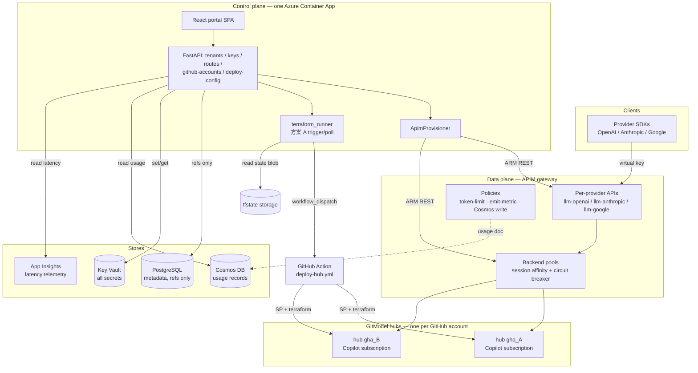

# Token Foundry

**English** | [中文](README.zh.md)

Azure-native LLM token hub / AI gateway. A hybrid control plane on top of Azure
API Management's GenAI gateway — multi-provider (Anthropic Claude / Google
Gemini / OpenAI), per-tenant virtual keys, token/cost metering, and a React
portal. Each provider gets its own APIM API with the provider's native
subscription-key header, so the provider's own SDK works against the gateway.

Model capacity comes from **GitModel hubs** onboarded cloud-automatically
(**方案 A**): adding a GitHub Copilot account deploys a dedicated hub Container
App (via a GitHub Action) and joins it to APIM's load-balanced pools — so every
provider pool fans out across accounts with session affinity.

## Architecture



> **The one invariant:** the control plane configures the gateway (management
> plane) and **never sits in the request path**. LLM traffic goes client → APIM
> → hub, metered by APIM policy. There is **one** Cosmos DB — APIM *writes* a
> usage record on every call (outbound policy), and FastAPI *reads* that same
> store for the usage page. The full system diagram, the 方案 A onboarding
> sequence, and the entity model live in
> **[docs/architecture.md](docs/architecture.md)** ([中文](docs/architecture.zh.md)).


- **APIM = data plane** — auth, token-limiting, routing, load-balance + circuit
  breaker, and the **outbound policy that writes one usage record per call
  directly to Cosmos** (managed-identity auth, `send-one-way-request` so the LLM
  response is never blocked).
- **FastAPI = control plane** — provisioning + accounting + enforcement; reads
  usage back from Cosmos and latency from App Insights; also serves the built
  SPA (one image, one Container App, no nginx).
- **React = human layer** — operator console (admin) + customer portal.

### How usage is captured (the billing path)

The portal's usage numbers were `0` until this path existed — there was no
writer. It now works as a single direct write:

1. A client calls a provider API through APIM with its virtual key.
2. On a successful response, APIM's **outbound policy**
   (`apim/policies/outbound-cosmos-write.xml`) POSTs one document to the Cosmos
   `usage` container — the **raw provider response JSON** plus metadata (request
   id, subscription/virtual-key id, timestamp, API name, partition key). Tokens
   are *not* parsed at write time; they live inside `raw_response`.
3. The control plane parses tokens at **read** time (`app/api/usage.py`),
   handling each provider's shape (`prompt_tokens`/`completion_tokens`,
   Anthropic + OpenAI-Responses `input_tokens`/`output_tokens`, cached-token
   variants), and resolves a record's tenant by matching its virtual-key id
   against PostgreSQL (`virtual key → project → tenant`).

This is a deliberate MVP trade-off: `send-one-way-request` is fire-and-forget,
so a failed write is **not retried** (occasional loss is acceptable for trend
usage). Billing-grade, replayable accounting is the **planned** Event Hub path
(Phase 2 — the stream + consumer are not built yet).

### The usage page has two data sources, shown separately

- **Usage & cost — from Cosmos** (the billing source): per-call log with model,
  project/key, prompt/completion/cached tokens.
- **Calls & latency — from App Insights** (telemetry, may be sampled): call
  counts, p50/p95, **gateway vs backend latency split** (APIM time vs LLM time),
  failures, and a calls-per-hour trend. Sampled data is fine for
  health/performance but **must not** be used for billing — that's why the two
  sources are kept apart.

## Why this architecture

The design goal is to **own the control plane (tenancy, keys, billing, routing
policy) while renting the data plane from a managed gateway** instead of
building one. Concretely:

### Why APIM, not a hand-rolled gateway

- **Token governance is a built-in policy, not app code.** `llm-token-limit`
  enforces per-virtual-key TPM/quota and returns `429`/`403` *inside the
  gateway*, and `llm-emit-token-metric` streams prompt/completion/cached token
  counts to App Insights — both dimensioned by tenant/subscription. Re-creating
  this in a proxy means re-implementing token accounting for every provider's
  response shape and keeping a distributed rate-limit counter yourself.
- **These policies understand each provider's token shape — including
  streaming.** The gateway counts tokens for OpenAI Chat/Responses, Anthropic
  Messages, and Google natively, and keeps counting on **streamed (SSE)
  responses** without buffering the stream. The control plane never parses a
  provider payload to meter it.
- **Resilience is configuration, not a library.** Per-backend **circuit
  breakers** (trip on repeated 5xx, honor `Retry-After`) and **load-balanced
  backend pools** are declared on the backend object — no Polly/Hystrix glue in
  the request path.
- **Scale is a SKU change, not a re-architecture.** APIM scales horizontally by
  adding **units** (each a dedicated slice of throughput), supports **autoscale**
  on a schedule or load, and a single instance can span **multiple regions** for
  geo-distribution and HA. Because all of that lives on the gateway resource, the
  control plane, policies, and routing logic are untouched when you scale — the
  app never becomes the throughput ceiling.
- **The provider's own SDK just works.** Each provider gets its own APIM API
  carrying that provider's *native* subscription-key header (`x-api-key` for
  Anthropic, `api-key` for OpenAI/Azure/Google), so a client points its existing
  SDK at the gateway URL and changes nothing else.
- **Usage capture costs zero app latency.** The **outbound policy** writes one
  usage record per call straight to Cosmos via `send-one-way-request`
  (fire-and-forget, managed-identity auth) — the LLM response is never blocked
  on the write, and no app process sits in the response path.
- **No upstream keys on the data path.** Real provider keys live in Key Vault
  and are attached to the APIM backend; clients only ever hold a per-tenant
  virtual key (an APIM subscription) that can be suspended/revoked
  independently. The gateway authenticates to Azure resources (Cosmos, AOAI)
  with its **managed identity** — secretless.

### Why the rest of the shape

- **Control/data-plane split.** FastAPI only *provisions and reads* (creates
  APIM products/subscriptions/backends via ARM, parses usage at read time); it
  is never in the per-request hot path, so a control-plane deploy can't take the
  gateway down.
- **One image, one Container App.** The API and the built React SPA ship in a
  single image (no nginx sidecar), so an app change is one `az acr build` + one
  revision roll — exactly the path used to ship the streaming update.
- **Two usage sources, kept apart.** Cosmos is the billing source (exact,
  per-call); App Insights is the telemetry source (sampled — call counts,
  p50/p95, gateway-vs-backend latency split). Sampled data never feeds billing.
- **Azure-native, secretless integration.** Managed identity + Key Vault
  references everywhere; Cosmos runs with `disableLocalAuth` (AAD-only). Fewer
  secrets to rotate, and Terraform (workspace-isolated per env) reproduces the
  whole stack.

> Trade-off, stated honestly: the MVP usage write is fire-and-forget, so an
> occasional dropped record is acceptable for *trend* usage. Billing-grade,
> replayable accounting is the planned Event Hub path (Phase 2).

## Layout

```text
app/            FastAPI control plane (models / services / api)
portal/         React + Vite frontend
terraform/      Terraform IaC (root + modules; azapi for APIM preview API)
scripts/        bootstrap.sh · deploy.sh · create-deployer-sp.sh · update-app.sh
vendored/       GitModel hub (per-account, deployed via GitHub Action)
.github/        deploy-hub.yml — the 方案 A per-account hub Action
docs/           architecture / security / deployment / APIM-gateway docs
tests/          pytest (pure, no Azure); tests/manual = live-gateway scripts
```

## Infrastructure (Terraform)

The whole environment is **Terraform**, state isolated **per environment via a
workspace** (no remote backend block — each env is its own `terraform workspace`,
so states never collide). Resource names are **derived from the resource-group
id** (`suffix = substr(md5(rg.id), 0, 13)`), so a new environment can't collide
with an old one's names — even soft-deleted Key Vault / APIM.

`scripts/deploy.sh` runs one `terraform apply` and builds two images in parallel
(the control-plane app + the pre-built GitModel hub) with `az acr build`.
`scripts/bootstrap.sh` chains that with `create-deployer-sp.sh` (the 方案 A
Service Principal). See **[docs/DEPLOYMENT.md](docs/DEPLOYMENT.md)** for the full
three-phase flow.

### What each module provisions (`terraform/modules/`)

| Module | Resource | Notes worth knowing |
|---|---|---|
| `monitor` | Log Analytics + App Insights | Workspace retention 30 days. App Insights is the latency/telemetry source the usage page queries via KQL. |
| `keyvault` | Key Vault | **RBAC authorization** (not access policies); soft-delete 7 days. Identities are granted roles in the consuming modules. |
| `postgres` | PostgreSQL Flexible Server 16 | `Standard_B1ms` burstable. Firewall rule `AllowAzureServices` lets Container Apps reach it — tighten to VNet in prod. |
| `cosmos` | Cosmos DB for NoSQL | **Serverless**, `disableLocalAuth: true` (AAD-only). DB `tokenfoundry`, container `usage`, partition key `/pk` (`subscriptionId_yyyymm`), **90-day TTL**. |
| `acr` | Container Registry (Basic) | `adminUserEnabled: false` — pull is via the Container App's managed identity (AcrPull). Holds `tokenfoundry:<tag>` **and** `gitmodel:<tag>` (the hub image). |
| `apim` | API Management (Developer SKU) | System-assigned identity. Sets up the App Insights logger + diagnostic and grants its identity **Cosmos Data Contributor** so the outbound policy can write usage. |
| `apim-backends` | Backend pool + circuit breakers | Uses the **preview** API version via `azapi`. Placeholder pool; real per-provider pools + per-account hub backends are created at **runtime** by the FastAPI provisioner. |
| `deployer` | tfstate storage account | Remote-state blob container the **方案 A** GitHub Action reads/writes per-account hub state (`hubs/<id>.tfstate`); the control plane reads outputs from it. |
| `appsecrets` | Key Vault secrets | Assembles the Postgres connection string and writes `tf-database-url` / `tf-jwt-secret` / `tf-admin-password`. |
| `containerapps` | Container App (API + portal) | Injects all `TF_*` env (incl. `TF_ACR_NAME` / `TF_KEYVAULT_NAME` / `TF_HUB_IMAGE_TAG` the deploy-config flow needs). See identity/RBAC below. |

### Identities & RBAC (who can touch what)

The Container App uses **two** identities by design:

- **User-assigned (`*-acrpull-id`)** — granted AcrPull + Key Vault Secrets User
  *before* the app exists, so the first revision can pull its image and resolve
  secret references without a chicken-and-egg race.
- **System-assigned** — the runtime identity (`DefaultAzureCredential`). Granted
  at runtime: **APIM Service Contributor** (provision products/subs/backends),
  **Key Vault Secrets Officer** (write subscription keys + BYO secrets),
  **Cosmos DB Data Contributor** (read usage — data-plane RBAC, distinct from
  control-plane), and **Monitoring Reader** on App Insights (KQL telemetry).

APIM's system identity is separately granted **Cosmos DB Data Contributor** for
the outbound-policy write path.

The **方案 A deployment Service Principal** (created by
`scripts/create-deployer-sp.sh`) is a separate identity — subscription
**Contributor** + **User Access Administrator**, plus **Key Vault Secrets User**
and **Storage Blob Data Contributor** on the tfstate account. It runs the
per-account hub Terraform inside the GitHub Action; its creds live in GitHub repo
secrets (and Key Vault). See [docs/SECURITY.md](docs/SECURITY.md).

### Runtime configuration (`TF_*` env vars)

`app/config.py` reads these (prefix `TF_`); Container Apps injects them, secrets
as Key Vault references:

| Env var | Source | Purpose |
|---|---|---|
| `TF_DATABASE_URL` | KV `tf-database-url` | PostgreSQL SQLAlchemy URL. |
| `TF_JWT_SECRET` | KV `tf-jwt-secret` | Signs self-hosted login JWTs. |
| `TF_ADMIN_USERNAME` / `TF_ADMIN_PASSWORD` | env / KV | Seed admin credentials. |
| `TF_COSMOS_ENDPOINT` | cosmos module | Usage store endpoint. |
| `TF_APIM_SERVICE_NAME` | apim module | Target for runtime provisioning. |
| `TF_APP_INSIGHTS_RESOURCE_ID` | monitor module | Resource the usage-telemetry KQL runs against. Without it the App Insights block degrades to empty. |
| `TF_RESOURCE_GROUP` / `TF_AZURE_SUBSCRIPTION_ID` | deployment | ARM scope for the provisioner. |
| `TF_ACR_NAME` / `TF_KEYVAULT_NAME` / `TF_ACR_LOGIN_SERVER` / `TF_AZURE_LOCATION` | terraform | Pure values the Portal's deploy-config flow publishes as `HUB_*` GitHub Actions variables. |
| `TF_HUB_IMAGE_TAG` | terraform (`image_tag`) | The `gitmodel:<tag>` the hub deploy pulls — set to the tag `deploy.sh` actually built (never a hard-coded `:latest`). |
| `TF_TFSTATE_STORAGE_ACCOUNT` / `TF_TFSTATE_CONTAINER` | deployer module | 方案 A remote-state location. |
| `TF_ENVIRONMENT` | static `prod` | Gates the local dev-token auth bypass. |

## Run it (inside the Dev Container)

Open the repo in the Dev Container (VS Code: "Reopen in Container"). It installs
Python + Node + azure-cli + Terraform, and runs `pip install -e .[dev]` and
`npm install`.

### 1. Authenticate to Azure

```bash
az login
az account set --subscription <your-sub-id>
```

`DefaultAzureCredential` (backend) and Terraform both reuse this `az login`.

### 2. Validate everything (no cloud needed)

```bash
# Backend: lint, type-check, unit tests
ruff check app tests
mypy app
pytest -q

# Frontend: type-check + production build
cd portal && npm run build && cd ..

# Terraform: format + validate
cd terraform && terraform fmt -check && terraform validate && cd ..
```

### 3. Run the stack locally

```bash
# Backend (needs a local Postgres or TF_DATABASE_URL pointing at one)
cp .env.example .env          # fill TF_* values
uvicorn app.main:app --reload --port 8000

# Frontend (separate terminal)
cd portal
cp .env.example .env          # VITE_DEV_TOKEN=dev:admin: for local admin
npm run dev                   # http://localhost:5173, proxies /api -> :8000
```

Local auth uses a dev token (`dev:<role>:<tenant>`) that the backend accepts only
when `TF_ENVIRONMENT=local` — no Entra needed to exercise the flow end-to-end.

### 4. Deploy

One command stands up a whole environment. First select the workspace and set
the RG name (see [docs/DEPLOYMENT.md](docs/DEPLOYMENT.md) for tfvars details):

```bash
cd terraform && terraform workspace new dev-a01 && cd ..   # isolated state
# edit terraform/terraform.tfvars: resource_group_name = "tokenfoundry-rg-dev-a01" (+ passwords)

az login && az account set --subscription <id>
./scripts/bootstrap.sh -g tokenfoundry-rg-dev-a01
```

`bootstrap.sh` runs `deploy.sh` (one `terraform apply` + parallel `az acr build`
of the app **and** hub images; APIM is the ~30–45 min long pole; ends with a
`/healthz` smoke test) then `create-deployer-sp.sh` (the 方案 A SP). The two
GitHub PATs are pasted **in the Portal** afterwards — GitHub can't mint PATs via
API. Then adding a GitHub account onboards a GitModel hub (方案 A).

App-only updates skip Terraform — rebuild + roll the revision (auto-discovers the
ACR / Container App in the RG):

```bash
./scripts/update-app.sh -g tokenfoundry-rg-dev-a01           # az acr build + revision roll
```

## Verification (end-to-end checklist)

1. `az login` in the container; `./scripts/bootstrap.sh -g <rg>` — APIM /
   PostgreSQL / Cosmos / Monitor / ACR / Container App up; deployer SP created,
   `/healthz` returns `{"status":"ok"}`.
2. Portal → **GitHub Accounts → Deploy configuration**: paste the two PATs → SP
   creds auto-push to the repo (`ARM_*` secrets + `HUB_*`/`TFSTATE_*` variables);
   the badge flips **Ready**.
3. Portal → **+ GitHub account** → device-flow login → a hub Container App
   deploys (方案 A GitHub Action), joins the 3 provider pools, and its chat
   models register as pooled routes; account goes **READY**.
4. Admin console → create tenant + project + issue a virtual key (optionally a
   per-key TPM and a token-quota tier) → APIM gets the Product/Subscription, key
   lands in Key Vault.
5. Call a provider API with the key (e.g. `POST {gateway}/llm-openai/v1/chat/completions`
   with the virtual key in the `api-key` header) → completion; over-TPM → 429,
   over-quota → 403.
6. Multi-provider: switch the `model` in the body and call the matching provider
   path — `claude-*` → `/llm-anthropic/v1/messages` (`x-api-key` header),
   `gpt-5.x` → `/llm-openai/v1/responses`, other OpenAI/Gemini →
   `/v1/chat/completions` → all route to the pooled hubs with session affinity.
7. **Usage page → pick the tenant**: the *Cosmos* block shows real prompt/
   completion tokens + a per-call log; the *App Insights* block shows call
   counts, p50/p95, gateway-vs-backend split, and the hourly trend.
8. Small budget → `budget_enforcer` suspends the subscription → 401 thereafter.
9. Customer portal: customer sees only their tenant; cross-tenant access
   rejected by the tenant-scope middleware.

To smoke-test every registered model end-to-end through the gateway, run
`python tests/manual/smoke_test_models.py` — it auto-discovers the models from the
control plane, calls each through its provider path (routing `gpt-5.x` to the
Responses API), and prints a pass/fail table. Configure the gateway URL and a
virtual key via a local `.env` (gitignored); see the script's header for the
required variables.

## Security & data model

How secrets and data are stored — what lives in Key Vault vs. PostgreSQL vs.
Cosmos, how callers and users are authenticated, the RBAC model, and the honest
list of trade-offs — is documented in
**[docs/SECURITY.md](docs/SECURITY.md)** ([中文](docs/SECURITY.zh.md)).

## Documentation

| Doc | What it covers |
|---|---|
| **[docs/DEPLOYMENT.md](docs/DEPLOYMENT.md)** ([中文](docs/DEPLOYMENT.zh.md)) | Standing up an environment: `bootstrap.sh`, Terraform workspace/tfvars setup, the 3-phase flow (deploy → deploy-config → add account), teardown. |
| **[docs/architecture.md](docs/architecture.md)** ([中文](docs/architecture.zh.md)) | System layers, 方案 A onboarding sequence, the entity model, and where each secret lives (Mermaid diagrams). |
| **[docs/SECURITY.md](docs/SECURITY.md)** ([中文](docs/SECURITY.zh.md)) | Secret storage, authentication, RBAC, 方案 A secret tiers, trade-offs. |
| **[docs/APIM-LLM-Gateway.md](docs/APIM-LLM-Gateway.md)** | The APIM LLM-gateway design: pools, session affinity, prompt caching. |

## Implementation status

- **Working today:** data model, control-plane API + tenant-scope auth, APIM
  provisioning service, multi-provider model routes, admin + customer portal,
  **Terraform for all PaaS** (workspace-isolated per env), token-limit +
  emit-token-metric policy, **per-key TPM + token-quota limits** (named-value
  driven), **方案 A cloud-automatic GitModel hub onboarding** (device flow →
  GitHub Action → pool join), **APIM→Cosmos direct usage capture**, and the
  **dual-source usage page** (Cosmos billing + App Insights latency).
- **Phase 2 (planned):** Event Hub billing worker for replayable/retry-safe
  accounting, semantic cache, BYO credential isolation, budget $-enforcement via
  the stream, chargeback.
