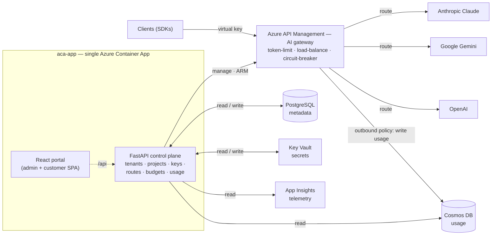

# Token Foundry

**English** | [中文](README.zh.md)

Azure-native LLM token hub / AI gateway. A hybrid control plane on top of Azure
API Management's GenAI gateway — multi-provider (Anthropic Claude / Google
Gemini / OpenAI), per-tenant virtual keys, token/cost metering, and a React
portal. Each provider gets its own APIM API with the provider's native
subscription-key header, so the provider's own SDK works against the gateway.

## Architecture



> There is **one** Cosmos DB. APIM *writes* a usage record to it on every call
> (outbound policy); FastAPI *reads* from that same store for the usage page —
> that's why one node has both a write arrow in and a read arrow out. A polished
> rendering is at [`docs/architecture.png`](docs/architecture.png); this Mermaid
> diagram is the authoritative source.

- **APIM = data plane** — auth, token-limiting, routing, load-balance + circuit
  breaker, and the **outbound policy that writes one usage record per call
  directly to Cosmos** (managed-identity auth, `send-one-way-request` so the LLM
  response is never blocked).
- **FastAPI = control plane** — provisioning + accounting + enforcement; reads
  usage back from Cosmos and latency from App Insights; also serves the built
  SPA (one image, one Container App, no nginx).
- **React = human layer** — operator console (admin) + customer portal.

### How usage is captured (the billing path)

The portal's usage numbers were `0` until this path existed — there was no
writer. It now works as a single direct write:

1. A client calls a provider API through APIM with its virtual key.
2. On a successful response, APIM's **outbound policy**
   (`apim/policies/outbound-cosmos-write.xml`) POSTs one document to the Cosmos
   `usage` container — the **raw provider response JSON** plus metadata (request
   id, subscription/virtual-key id, timestamp, API name, partition key). Tokens
   are *not* parsed at write time; they live inside `raw_response`.
3. The control plane parses tokens at **read** time (`app/api/usage.py`),
   handling each provider's shape (`prompt_tokens`/`completion_tokens`,
   Anthropic + OpenAI-Responses `input_tokens`/`output_tokens`, cached-token
   variants), and resolves a record's tenant by matching its virtual-key id
   against PostgreSQL (`virtual key → project → tenant`).

This is a deliberate MVP trade-off: `send-one-way-request` is fire-and-forget,
so a failed write is **not retried** (occasional loss is acceptable for trend
usage). Billing-grade, replayable accounting is the Event Hub path below — the
namespace is provisioned but **not yet wired** (`worker/eventhub_consumer.py`
is a stub).

### The usage page has two data sources, shown separately

- **Usage & cost — from Cosmos** (the billing source): per-call log with model,
  project/key, prompt/completion/cached tokens.
- **Calls & latency — from App Insights** (telemetry, may be sampled): call
  counts, p50/p95, **gateway vs backend latency split** (APIM time vs LLM time),
  failures, and a calls-per-hour trend. Sampled data is fine for
  health/performance but **must not** be used for billing — that's why the two
  sources are kept apart.

## Layout

```text
app/            FastAPI control plane (models / services / api)
worker/         Event Hub consumer (Phase 2 — stub, not wired)
portal/         React + Vite frontend
infra/          Bicep IaC (main + lite + modules + Grafana dashboards)
apim/policies/  APIM policy XML (data-plane core)
docs/           architecture diagram
tests/          pytest (billing logic — pure, no Azure)
```

## Infrastructure (Bicep)

Two entry points:

| File | What it deploys | When to use |
|---|---|---|
| `infra/main.lite.bicep` | Monitor, Key Vault, PostgreSQL, Cosmos, Event Hub, ACR | Fast first pass — stands up the cheap data + observability tier so you can `az acr build` while APIM provisions. |
| `infra/main.bicep` | Everything in lite **plus** APIM (~30–45 min), the APIM backend pool, Grafana, app secrets, and the Container App | Full deployment. |

### Deploy parameters (passed to `main.bicep`)

These are the values **you provide** at deploy time, defined in
`infra/main.bicepparam` (non-secrets) or on the command line (secrets):

| Parameter | Secret | Default | Meaning |
|---|---|---|---|
| `namePrefix` | no | `tokenfoundry` | Prefix for every resource name (e.g. `tokenfoundry-apim`). Globally-unique resources (Cosmos / Key Vault / ACR) also append a hash of the resource-group id. |
| `location` | no | `centralus` | Azure region for all resources. **Keep it `centralus`** — this subscription blocks PostgreSQL in some regions (e.g. eastus); one region avoids cross-region issues. |
| `environmentName` | no | `dev` | Tag only (`dev` \| `prod`); applied to every resource for cost grouping. |
| `pgAdminLogin` | no | `tfadmin` | PostgreSQL administrator username. |
| `pgAdminPassword` | **yes** | — | PostgreSQL admin password. Pass via `-p pgAdminPassword=$PG_PWD`; **never** hardcode it in the `.bicepparam`. Assembled into the DB connection string and stored as a Key Vault secret (`tf-database-url`). |
| `jwtSecret` | **yes** | — | HS256 signing secret for the self-hosted login JWTs. Stored as `tf-jwt-secret`. |
| `adminPassword` | **yes** | — | Password for the seed `admin` account created on first boot. Stored as `tf-admin-password`. |
| `appImage` | no | placeholder | Full image ref the Container App runs, e.g. `<acr>.azurecr.io/tokenfoundry:v6`. Chicken-and-egg: deploy lite → `az acr build` → set this → deploy full. |

Example:

```bash
az deployment group create -g <rg> -f infra/main.bicep \
  -p infra/main.bicepparam \
  -p pgAdminPassword=$PG_PWD -p jwtSecret=$JWT -p adminPassword=$ADMIN_PWD \
  -p appImage=<acr>.azurecr.io/tokenfoundry:v6
```

### What each module provisions (and the non-obvious settings)

| Module | Resource | Notes worth knowing |
|---|---|---|
| `monitor` | Log Analytics + App Insights | Workspace retention 30 days. App Insights is the latency/telemetry source the usage page queries via KQL. |
| `keyvault` | Key Vault | **RBAC authorization** (not access policies); soft-delete 7 days. Identities are granted roles in the consuming modules. |
| `postgres` | PostgreSQL Flexible Server 16 | `Standard_B1ms` burstable, 32 GB. Firewall rule `AllowAzureServices` (0.0.0.0) lets Container Apps reach it — tighten to VNet in prod. |
| `cosmos` | Cosmos DB for NoSQL | **Serverless**, `disableLocalAuth: true` (AAD-only — no keys). DB `tokenfoundry`, container `usage`, partition key `/pk` (`subscriptionId_yyyymm`), **90-day TTL** on raw docs. |
| `eventhub` | Event Hub namespace + `usage` hub | Provisioned for the Phase-2 billing stream; **not wired yet**. Standard tier, 2 partitions, 1-day retention, `billing` consumer group. |
| `acr` | Container Registry (Basic) | `adminUserEnabled: false` — pull is via the Container App's managed identity (AcrPull). |
| `apim` | API Management (Developer SKU) | System-assigned identity. Sets up the App Insights **logger + diagnostic** (sampling **100%** — the cost/detail knob, see the module comment) and grants its own identity **Cosmos Data Contributor** so the outbound policy can write usage. |
| `apim-backends` | Backend pool + circuit breakers | Uses the **preview** API version (native in Bicep — the reason we chose Bicep over Terraform). Placeholder pool; real per-provider backends are created at runtime by the FastAPI provisioner. |
| `grafana` | Azure Managed Grafana | System identity granted **Monitoring Reader** on the RG so dashboards render (previously a manual step). |
| `appsecrets` | Key Vault secrets | Assembles the Postgres connection string (so the password never lands in app settings) and writes `tf-database-url` / `tf-jwt-secret` / `tf-admin-password`. |
| `containerapps` | Container App (API + portal) | See identity/RBAC below. |

### Identities & RBAC (who can touch what)

The Container App uses **two** identities by design:

- **User-assigned (`*-acrpull-id`)** — granted AcrPull + Key Vault Secrets User
  *before* the app exists, so the first revision can pull its image and resolve
  secret references without a chicken-and-egg race.
- **System-assigned** — the runtime identity (`DefaultAzureCredential`). Granted
  at runtime: **APIM Service Contributor** (provision products/subs/backends),
  **Key Vault Secrets Officer** (write subscription keys + BYO secrets),
  **Cosmos DB Data Contributor** (read usage — data-plane RBAC, distinct from
  control-plane), and **Monitoring Reader** on App Insights (KQL telemetry).

APIM's system identity is separately granted **Cosmos DB Data Contributor** for
the outbound-policy write path.

### Runtime configuration (`TF_*` env vars)

`app/config.py` reads these (prefix `TF_`); Container Apps injects them, secrets
as Key Vault references:

| Env var | Source | Purpose |
|---|---|---|
| `TF_DATABASE_URL` | KV `tf-database-url` | PostgreSQL SQLAlchemy URL. |
| `TF_JWT_SECRET` | KV `tf-jwt-secret` | Signs self-hosted login JWTs. |
| `TF_ADMIN_USERNAME` / `TF_ADMIN_PASSWORD` | env / KV | Seed admin credentials. |
| `TF_COSMOS_ENDPOINT` | cosmos module | Usage store endpoint. |
| `TF_APIM_SERVICE_NAME` | apim module | Target for runtime provisioning. |
| `TF_APP_INSIGHTS_RESOURCE_ID` | monitor module | Resource the usage-telemetry KQL runs against. Without it the App Insights block degrades to empty. |
| `TF_RESOURCE_GROUP` / `TF_AZURE_SUBSCRIPTION_ID` | deployment | ARM scope for the provisioner. |
| `TF_ENVIRONMENT` | static `prod` | Gates the local dev-token auth bypass. |

## Run it (inside the Dev Container)

Open the repo in the Dev Container (VS Code: "Reopen in Container"). It installs
Python + Node + azure-cli (with `az bicep`) and runs `pip install -e .[dev]` and
`npm install`.

### 1. Authenticate to Azure

```bash
az login
az account set --subscription <your-sub-id>
```

`DefaultAzureCredential` (backend) and `az deployment` (Bicep) both reuse this.

### 2. Validate everything (no cloud needed)

```bash
# Backend: lint, type-check, unit tests
ruff check app worker tests
mypy app
pytest -q

# Frontend: type-check + production build
cd portal && npm run typecheck && npm run build && cd ..

# Bicep: compile + preview against a resource group
az bicep build --file infra/main.bicep
az deployment group what-if -g <rg> -f infra/main.bicep \
  -p infra/main.bicepparam -p pgAdminPassword=<pwd>
```

### 3. Run the stack locally

```bash
# Backend (needs a local Postgres or TF_DATABASE_URL pointing at one)
cp .env.example .env          # fill TF_* values
uvicorn app.main:app --reload --port 8000

# Frontend (separate terminal)
cd portal
cp .env.example .env          # VITE_DEV_TOKEN=dev:admin: for local admin
npm run dev                   # http://localhost:5173, proxies /api -> :8000
```

Local auth uses a dev token (`dev:<role>:<tenant>`) that the backend accepts only
when `TF_ENVIRONMENT=local` — no Entra needed to exercise the flow end-to-end.

### 4. Deploy

```bash
az group create -n <rg> -l centralus

# (optional) fast first pass — data + observability tier only
az deployment group create -g <rg> -f infra/main.lite.bicep \
  -p namePrefix=tokenfoundry -p pgAdminPassword=<pwd>

# build & push the single image (root Dockerfile builds portal + API)
az acr build -r <acr> -t tokenfoundry:v6 .

# full deployment
az deployment group create -g <rg> -f infra/main.bicep \
  -p infra/main.bicepparam \
  -p pgAdminPassword=<pwd> -p jwtSecret=<jwt> -p adminPassword=<admin-pwd> \
  -p appImage=<acr>.azurecr.io/tokenfoundry:v6
```

Subsequent app-only updates skip the deployment — rebuild and roll the revision:

```bash
az acr build -r <acr> -t tokenfoundry:v7 .
az containerapp update -g <rg> -n <prefix>-aca-app \
  --image <acr>.azurecr.io/tokenfoundry:v7
```

## Verification (end-to-end checklist)

1. `az login` in the container.
2. `az deployment group create …` — APIM / PostgreSQL / Cosmos / Monitor /
   Grafana up; backend pool + circuit breaker created (preview API version).
3. Admin console → create tenant + project + issue key + add model alias → APIM
   gets the Product/Subscription/backend, key lands in Key Vault.
4. Call a provider API with the key (e.g. `POST {gateway}/llm-openai/v1/chat/completions`
   with the virtual key in the `api-key` header) → completion; over-TPM → 429.
5. Multi-provider: switch the `model` in the body and call the matching provider
   path — `claude-*` → `/llm-anthropic/v1/messages` (`x-api-key` header),
   `gpt-5.x` → `/llm-openai/v1/responses`, other OpenAI/Gemini →
   `/v1/chat/completions` → all route correctly.
6. **Usage page → pick the tenant**: the *Cosmos* block shows real prompt/
   completion tokens + a per-call log; the *App Insights* block shows call
   counts, p50/p95, gateway-vs-backend split, and the hourly trend.
7. Grafana renders cross-tenant usage/cost/TPM.
8. Small budget → `budget_enforcer` suspends the subscription → 401 thereafter.
9. Azure Monitor alert → Action Group on budget threshold.
10. Customer portal: customer sees only their tenant; cross-tenant access
    rejected by the tenant-scope middleware.

To smoke-test every registered model end-to-end through the gateway, run
`python scripts/smoke_test_models.py` — it auto-discovers the models from the
control plane, calls each through its provider path (routing `gpt-5.x` to the
Responses API), and prints a pass/fail table. Configure the gateway URL and a
virtual key via a local `.env` (gitignored); see the script's header for the
required variables.

## Implementation status

- **Working today:** data model, control-plane API + tenant-scope auth, APIM
  provisioning service, multi-provider model routes, admin + customer portal,
  Bicep for all PaaS, token-limit + emit-token-metric policy, **APIM→Cosmos
  direct usage capture**, **dual-source usage page** (Cosmos billing + App
  Insights latency), Grafana dashboards.
- **Phase 2 (provisioned, not wired):** Event Hub billing worker for
  replayable/retry-safe accounting, semantic cache, BYO credential isolation,
  budget $-enforcement via the stream, chargeback.
