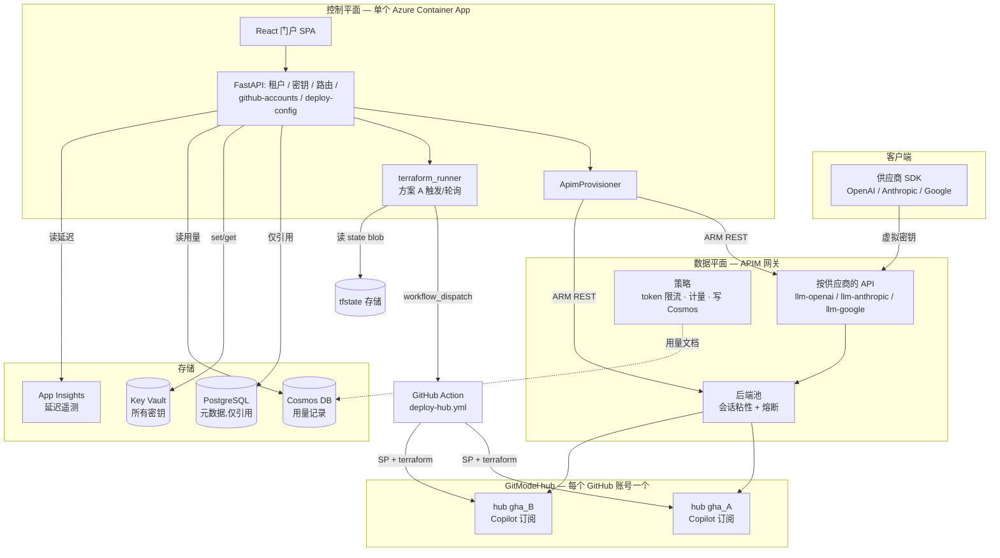
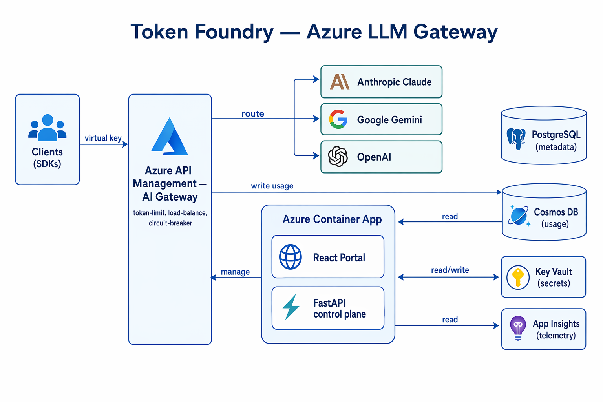

# Token Foundry

[English](README.md) | **中文**

Azure 原生的 LLM token 中枢 / AI 网关。在 Azure API Management 的 GenAI 网关之上构建的
混合控制平面 —— 多供应商(Anthropic Claude / Google Gemini / OpenAI)、按租户隔离的
虚拟密钥、token/成本计量,以及一个 React 门户。每个供应商都有自己独立的 APIM API,
沿用该供应商原生的订阅密钥请求头,因此供应商自家的 SDK 可以直接对着网关工作。

模型算力来自云端自动接入的 **GitModel hub**(**方案 A**):添加一个 GitHub Copilot 账号,
就会(经由一个 GitHub Action)部署一套专属的 hub Container App,并把它加入 APIM 的
负载均衡池 —— 于是每个供应商池都以会话粘性跨多个账号扇出。

## 架构



> **唯一不变量:** 控制平面配置网关(管理平面),**绝不介入请求路径**。LLM 流量走
> 客户端 → APIM → hub,由 APIM 策略计量。全系统只有**一个** Cosmos DB —— APIM 每次
> 调用写一条用量记录(出站策略),FastAPI 从同一个库读出来给用量页。完整的系统图、
> 方案 A 接入时序、实体模型见
> **[docs/architecture.md](docs/architecture.md)** ([中文](docs/architecture.zh.md))。



- **APIM = 数据平面** —— 鉴权、token 限流、路由、负载均衡 + 熔断,以及那条
  **每次调用直接把一条用量记录写进 Cosmos 的出站策略**(托管身份鉴权、
  `send-one-way-request`,所以绝不阻塞 LLM 响应)。
- **FastAPI = 控制平面** —— 只负责开通、计量、强制策略;从 Cosmos 读回用量、
  从 App Insights 读延迟;同时托管构建好的 SPA(一个镜像、一个 Container App、
  无需 nginx)。
- **React = 人机层** —— 运营控制台(管理端)+ 客户门户(客户端)。

### 用量是怎么采集的(计费链路)

在这条链路存在之前,门户的用量数字一直是 `0` —— 因为根本没有写入方。现在它是
一次直写就搞定:

1. 客户端带着虚拟密钥通过 APIM 调用某个供应商 API。
2. 响应成功时,APIM 的**出站策略**(`apim/policies/outbound-cosmos-write.xml`)
   往 Cosmos `usage` 容器 POST 一条文档 —— **供应商的原始响应 JSON** 加上元数据
   (请求 id、订阅/虚拟密钥 id、时间戳、API 名称、分区键)。写入时**不**解析 token,
   token 就留在 `raw_response` 里。
3. 控制平面在**读取**时才解析 token(`app/api/usage.py`),按各家格式处理
   (`prompt_tokens`/`completion_tokens`、Anthropic 与 OpenAI-Responses 的
   `input_tokens`/`output_tokens`、各种缓存 token 变体),并通过把记录里的
   虚拟密钥 id 与 PostgreSQL 比对(`虚拟密钥 → 项目 → 租户`)来确定该记录归属的租户。

这是一个有意为之的 MVP 取舍:`send-one-way-request` 是即发即忘,写入失败**不会重试**
(对趋势性用量来说偶尔丢失可以接受)。计费级、可重放的精确记账走**计划中的** Event Hub
链路(第二阶段 —— 流和消费者都尚未构建)。

### 用量页有两个数据源,分开展示

- **用量与成本 —— 来自 Cosmos**(计费源):每次调用的明细日志,含模型、项目/密钥、
  输入/输出/缓存 token。
- **调用与延迟 —— 来自 App Insights**(遥测,可能被采样):调用次数、p50/p95、
  **网关 vs 后端延迟拆分**(APIM 耗时 vs LLM 耗时)、失败数,以及每小时调用趋势。
  被采样的数据用于健康度/性能没问题,但**绝不能**用于计费 —— 这正是两个数据源
  分开的原因。

## 为什么这样设计

设计目标是:**自己掌控控制平面(租户、密钥、计费、路由策略),而把数据平面交给一个
托管网关、不去自建。** 具体来说:

### 为什么用 APIM,而不是自建网关

- **token 治理是内置策略,不是应用代码。** `llm-token-limit` 在网关内部按虚拟密钥
  强制 TPM/配额并返回 `429`/`403`,`llm-emit-token-metric` 把输入/输出/缓存 token 数
  推送到 App Insights —— 两者都按租户/订阅维度打标。要在自建代理里复刻这套,意味着
  为每家供应商的响应结构重写一遍 token 计量,还得自己维护一个分布式限流计数器。
- **这些策略理解每家供应商的 token 结构 —— 包括流式。** 网关原生为 OpenAI
  Chat/Responses、Anthropic Messages、Google 计数,并且在**流式(SSE)响应**下也能
  继续计数、不缓冲整条流。控制平面从不为了计量去解析供应商的响应体。
- **弹性是配置,不是一个库。** 按后端的**熔断**(连续 5xx 触发、遵守 `Retry-After`)
  和**负载均衡后端池**直接声明在 backend 对象上 —— 请求路径里没有任何
  Polly/Hystrix 之类的胶水代码。
- **扩容是改 SKU,不是重写架构。** APIM 通过增加 **unit**(每个 unit 是一份专属吞吐
  能力)做横向扩展,支持按计划或负载**自动伸缩**,单个实例还能横跨**多个区域**做
  地理分布与高可用。由于这些都属于网关资源本身,扩容时控制平面、策略和路由逻辑
  一律不动 —— 应用永远不会成为吞吐瓶颈。
- **供应商自家的 SDK 直接可用。** 每家供应商有自己独立的 APIM API,沿用该供应商
  *原生*的订阅密钥请求头(Anthropic 用 `x-api-key`,OpenAI/Azure/Google 用
  `api-key`),客户端只需把现有 SDK 指向网关 URL,其它一律不改。
- **用量采集零应用延迟。** **出站策略**通过 `send-one-way-request`(发完即走、
  托管身份鉴权)把每次调用的一条用量记录直接写进 Cosmos —— LLM 响应绝不因这次写入
  而阻塞,也没有任何应用进程挡在响应路径上。
- **数据路径上没有上游密钥。** 真实的供应商密钥存在 Key Vault 里、绑定到 APIM
  后端;客户端始终只持有一个按租户隔离的虚拟密钥(一个 APIM 订阅),可以被独立
  挂起/吊销。网关用自己的**托管身份**访问 Azure 资源(Cosmos、AOAI)—— 全程无密钥。

### 为什么是这套整体形态

- **控制面/数据面分离。** FastAPI 只负责*开通和读取*(通过 ARM 创建 APIM
  产品/订阅/后端,在读取时解析用量),从不处在每次请求的热路径上,所以一次控制面
  发布不会把网关搞挂。
- **一个镜像、一个 Container App。** API 和构建好的 React SPA 打进同一个镜像
  (无需 nginx sidecar),所以一次应用变更就是一次 `az acr build` + 一次 revision
  滚动 —— 这次上线流式改动走的正是这条路径。
- **两个用量来源,彼此分开。** Cosmos 是计费来源(精确、逐次调用);App Insights
  是遥测来源(会采样 —— 调用数、p50/p95、网关 vs 后端的延迟拆分)。采样数据绝不
  用于计费。
- **Azure 原生、无密钥集成。** 处处用托管身份 + Key Vault 引用;Cosmos 以
  `disableLocalAuth`(仅 AAD)运行。要轮换的密钥更少,而且 Terraform
  (按环境用 workspace 隔离)能复现整套环境。

> 诚实地说明取舍:MVP 的用量写入是发完即走的,所以偶尔丢一条记录、对*趋势*用量
> 是可接受的。计费级、可重放的精确记账走计划中的 Event Hub 那条路(第二阶段)。

## 目录结构

```text
app/            FastAPI 控制平面(models / services / api)
portal/         React + Vite 前端
terraform/      Terraform 基础设施即代码(根 + 模块;APIM preview API 用 azapi)
scripts/        bootstrap.sh · deploy.sh · create-deployer-sp.sh · update-app.sh
vendored/       GitModel hub(每账号,经 GitHub Action 部署)
.github/        deploy-hub.yml —— 方案 A 每账号 hub 的 Action
docs/           架构 / 安全 / 部署 / APIM 网关 文档
tests/          pytest(纯逻辑,不依赖 Azure);tests/manual = 联网网关脚本
```

## 基础设施(Terraform)

整套环境用 **Terraform**,state **按环境用 workspace 隔离**(没有远程 backend 块 —— 每个
环境是自己的 `terraform workspace`,state 互不冲突)。资源名**由资源组 id 派生**
(`suffix = substr(md5(rg.id), 0, 13)`),所以新环境不会和旧环境撞名 —— 连软删除的
Key Vault / APIM 残留都不会撞。

`scripts/deploy.sh` 跑一次 `terraform apply`,并用 `az acr build` 并行构建两个镜像
(控制平面 app + 预建的 GitModel hub)。`scripts/bootstrap.sh` 把它和
`create-deployer-sp.sh`(方案 A 的服务主体)串起来。完整的三阶段流程见
**[docs/DEPLOYMENT.md](docs/DEPLOYMENT.md)** ([中文](docs/DEPLOYMENT.zh.md))。

### 各模块开通了什么(`terraform/modules/`)

| 模块 | 资源 | 值得知道的点 |
|---|---|---|
| `monitor` | Log Analytics + App Insights | 工作区保留 30 天。App Insights 是用量页通过 KQL 查询的延迟/遥测源。 |
| `keyvault` | Key Vault | **RBAC 授权**(而非访问策略);软删除 7 天。各身份的角色在使用它的模块里授予。 |
| `postgres` | PostgreSQL Flexible Server 16 | `Standard_B1ms` 突发型。防火墙规则 `AllowAzureServices` 让 Container Apps 能连上 —— 生产环境应收紧为 VNet。 |
| `cosmos` | Cosmos DB for NoSQL | **Serverless**,`disableLocalAuth: true`(仅 AAD)。库 `tokenfoundry`,容器 `usage`,分区键 `/pk`(`subscriptionId_yyyymm`),**90 天 TTL**。 |
| `acr` | 容器注册表(Basic) | `adminUserEnabled: false` —— 拉取走 Container App 的托管身份(AcrPull)。同时存 `tokenfoundry:<tag>` **和** `gitmodel:<tag>`(hub 镜像)。 |
| `apim` | API Management(Developer SKU) | 系统分配身份。配置 App Insights 的 logger + diagnostic,并给自己的身份授予 **Cosmos Data Contributor**,使出站策略能写用量。 |
| `apim-backends` | 后端池 + 熔断器 | 经 `azapi` 使用**预览版** API 版本。占位池;真正的每供应商池 + 每账号 hub 后端由 FastAPI provisioner 在**运行时**创建。 |
| `deployer` | tfstate 存储账户 | **方案 A** 的 GitHub Action 读写每账号 hub state(`hubs/<id>.tfstate`)的远程 state blob 容器;控制平面从中读输出。 |
| `appsecrets` | Key Vault 密钥 | 拼装 Postgres 连接串,并写入 `tf-database-url` / `tf-jwt-secret` / `tf-admin-password`。 |
| `containerapps` | Container App(API + 门户) | 注入所有 `TF_*` env(含 deploy-config 流程需要的 `TF_ACR_NAME` / `TF_KEYVAULT_NAME` / `TF_HUB_IMAGE_TAG`)。见下方身份/RBAC。 |

### 身份与 RBAC(谁能动什么)

Container App 有意使用**两个**身份:

- **用户分配身份(`*-acrpull-id`)** —— 在应用存在*之前*就被授予 AcrPull +
  Key Vault Secrets User,这样第一个修订版就能拉取镜像、解析密钥引用,而不会
  陷入先有鸡还是先有蛋的竞态。
- **系统分配身份** —— 运行时身份(`DefaultAzureCredential`)。运行时被授予:
  **APIM Service Contributor**(开通产品/订阅/后端)、**Key Vault Secrets Officer**
  (写订阅密钥 + BYO 密钥)、**Cosmos DB Data Contributor**(读用量 —— 数据平面
  RBAC,区别于控制平面),以及 App Insights 上的 **Monitoring Reader**(KQL 遥测)。

APIM 的系统身份另外被单独授予 **Cosmos DB Data Contributor**,用于出站策略的写入链路。

**方案 A 的部署服务主体**(由 `scripts/create-deployer-sp.sh` 创建)是一个独立身份 ——
订阅级 **Contributor** + **User Access Administrator**,外加 tfstate 存储账户上的
**Key Vault Secrets User** 和 **Storage Blob Data Contributor**。它在 GitHub Action 里
跑每账号的 hub Terraform;creds 存在 GitHub repo secrets(以及 Key Vault)。见
[docs/SECURITY.md](docs/SECURITY.md)。

### 运行时配置(`TF_*` 环境变量)

`app/config.py` 读取这些变量(前缀 `TF_`);Container Apps 注入它们,密钥以
Key Vault 引用形式注入:

| 环境变量 | 来源 | 用途 |
|---|---|---|
| `TF_DATABASE_URL` | KV `tf-database-url` | PostgreSQL 的 SQLAlchemy URL。 |
| `TF_JWT_SECRET` | KV `tf-jwt-secret` | 签发自托管登录 JWT。 |
| `TF_ADMIN_USERNAME` / `TF_ADMIN_PASSWORD` | env / KV | 种子管理员凭据。 |
| `TF_COSMOS_ENDPOINT` | cosmos 模块 | 用量存储端点。 |
| `TF_APIM_SERVICE_NAME` | apim 模块 | 运行时开通的目标。 |
| `TF_APP_INSIGHTS_RESOURCE_ID` | monitor 模块 | 用量遥测 KQL 查询的目标资源。没有它,App Insights 区块会退化为空。 |
| `TF_RESOURCE_GROUP` / `TF_AZURE_SUBSCRIPTION_ID` | 部署时 | provisioner 的 ARM 作用域。 |
| `TF_ACR_NAME` / `TF_KEYVAULT_NAME` / `TF_ACR_LOGIN_SERVER` / `TF_AZURE_LOCATION` | terraform | 门户 deploy-config 流程发布成 `HUB_*` GitHub Actions 变量的纯值。 |
| `TF_HUB_IMAGE_TAG` | terraform(`image_tag`) | hub 部署要拉的 `gitmodel:<tag>` —— 设为 `deploy.sh` 实际构建的 tag(绝非写死的 `:latest`)。 |
| `TF_TFSTATE_STORAGE_ACCOUNT` / `TF_TFSTATE_CONTAINER` | deployer 模块 | 方案 A 远程 state 位置。 |
| `TF_ENVIRONMENT` | 静态 `prod` | 控制本地 dev-token 鉴权旁路是否开启。 |

## 运行(在 Dev Container 内)

在 Dev Container 中打开仓库(VS Code:"Reopen in Container")。它会安装
Python + Node + azure-cli + Terraform,并运行 `pip install -e .[dev]` 和
`npm install`。

### 1. 登录 Azure

```bash
az login
az account set --subscription <your-sub-id>
```

`DefaultAzureCredential`(后端)和 Terraform 都复用这次 `az login`。

### 2. 全面校验(无需云端)

```bash
# 后端:lint、类型检查、单元测试
ruff check app tests
mypy app
pytest -q

# 前端:类型检查 + 生产构建
cd portal && npm run build && cd ..

# Terraform:格式化 + 校验
cd terraform && terraform fmt -check && terraform validate && cd ..
```

### 3. 本地运行整套

```bash
# 后端(需要本地 Postgres,或让 TF_DATABASE_URL 指向一个)
cp .env.example .env          # 填好 TF_* 的值
uvicorn app.main:app --reload --port 8000

# 前端(另开一个终端)
cd portal
cp .env.example .env          # VITE_DEV_TOKEN=dev:admin: 本地管理员
npm run dev                   # http://localhost:5173,代理 /api -> :8000
```

本地鉴权使用一个 dev token(`dev:<role>:<tenant>`),后端仅在
`TF_ENVIRONMENT=local` 时接受 —— 无需 Entra 即可端到端跑通流程。

### 4. 部署

一条命令立起整套环境。先选中 workspace 并设好 RG 名(tfvars 细节见
[docs/DEPLOYMENT.md](docs/DEPLOYMENT.md)):

```bash
cd terraform && terraform workspace new dev-a01 && cd ..   # 隔离 state
# 编辑 terraform/terraform.tfvars: resource_group_name = "tokenfoundry-rg-dev-a01"(+ 密码)

az login && az account set --subscription <id>
./scripts/bootstrap.sh -g tokenfoundry-rg-dev-a01
```

`bootstrap.sh` 先跑 `deploy.sh`(一次 `terraform apply` + 并行 `az acr build` 构建
app **和** hub 镜像;APIM 是约 30–45 分钟的长杆;结尾做 `/healthz` 冒烟测试),
再跑 `create-deployer-sp.sh`(方案 A 的 SP)。之后在**门户里**粘贴两个 GitHub PAT ——
GitHub 无法通过 API 生成 PAT。然后添加一个 GitHub 账号即可接入一套 GitModel hub(方案 A)。

后续仅更新应用时跳过 Terraform —— 重新构建并滚动修订版即可(自动发现 RG 里的
ACR / Container App):

```bash
./scripts/update-app.sh -g tokenfoundry-rg-dev-a01           # az acr build + 滚动修订版
```

## 验证(端到端清单)

1. 容器内 `az login`;`./scripts/bootstrap.sh -g <rg>` —— APIM / PostgreSQL /
   Cosmos / Monitor / ACR / Container App 起来;部署 SP 建好,`/healthz`
   返回 `{"status":"ok"}`。
2. 门户 → **GitHub 账号 → 部署配置**:粘贴两个 PAT → SP creds 自动推到 repo
   (`ARM_*` secrets + `HUB_*`/`TFSTATE_*` 变量);徽章翻成 **Ready**。
3. 门户 → **+ GitHub 账号** → 设备流登录 → 部署一套 hub Container App
   (方案 A GitHub Action),加入 3 个供应商池,其 chat 模型注册成池化路由;
   账号变 **READY**。
4. 管理控制台 → 创建租户 + 项目 + 签发虚拟密钥(可选设每 key 的 TPM 和一个
   token-quota 档) → APIM 拿到产品/订阅,密钥落进 Key Vault。
5. 用密钥调用某供应商 API(如 `POST {gateway}/llm-openai/v1/chat/completions`,
   虚拟密钥放在 `api-key` 请求头)→ 拿到补全;超 TPM → 429,超配额 → 403。
6. 多供应商:改一下 body 里的 `model`,调用对应供应商路径 —— `claude-*`
   → `/llm-anthropic/v1/messages`(`x-api-key` 头),`gpt-5.x`
   → `/llm-openai/v1/responses`,其余 OpenAI/Gemini → `/v1/chat/completions`
   → 全部以会话粘性路由到池化的 hub。
7. **用量页 → 选租户**:*Cosmos* 区块显示真实的输入/输出 token + 每次调用明细;
   *App Insights* 区块显示调用次数、p50/p95、网关 vs 后端拆分,以及每小时趋势。
8. 设个很小的预算 → `budget_enforcer` 暂停订阅 → 此后 401。
9. 客户门户:客户只能看到自己的租户;跨租户访问被租户作用域中间件拒绝。

要端到端冒烟测试每个已登记模型,运行 `python tests/manual/smoke_test_models.py` ——
它会从控制平面自动发现模型,沿各自的供应商路径调用(把 `gpt-5.x` 路由到
Responses API),并打印一张通过/失败表。通过本地 `.env`(已 gitignore)配置网关
URL 和一个虚拟密钥;所需变量见脚本头部。

## 安全与数据模型

密钥和数据怎么存 —— 什么存在 Key Vault、什么存在 PostgreSQL、什么存在 Cosmos,
调用方和用户怎么鉴权,RBAC 模型,以及诚实的取舍清单 —— 都记在
**[docs/SECURITY.zh.md](docs/SECURITY.zh.md)**([English](docs/SECURITY.md))。

## 文档

| 文档 | 内容 |
|---|---|
| **[docs/DEPLOYMENT.zh.md](docs/DEPLOYMENT.zh.md)**([English](docs/DEPLOYMENT.md)) | 搭起一个环境:`bootstrap.sh`、Terraform workspace/tfvars 设置、三阶段流程(部署 → 部署配置 → 加账号)、销毁。 |
| **[docs/architecture.zh.md](docs/architecture.zh.md)**([English](docs/architecture.md)) | 系统分层、方案 A 接入时序、实体模型、各密钥存放位置(Mermaid 图)。 |
| **[docs/SECURITY.zh.md](docs/SECURITY.zh.md)**([English](docs/SECURITY.md)) | 密钥存储、鉴权、RBAC、方案 A 密钥分层、取舍。 |
| **[docs/APIM-LLM-Gateway.md](docs/APIM-LLM-Gateway.md)** | APIM LLM 网关设计:池、会话粘性、prompt 缓存、每 key 限额、SKU 支持。 |
| **[docs/PRICING.zh.md](docs/PRICING.zh.md)**([English](docs/PRICING.md)) | 分档价格与选型:APIM SKU 价格 + 吞吐量、整套环境月度估算、何时升级。 |

## 实现状态

- **当前可用:** 数据模型、控制平面 API + 租户作用域鉴权、APIM 开通服务、
  多供应商模型路由、管理端 + 客户端门户、**覆盖全部 PaaS 的 Terraform**
  (按环境用 workspace 隔离)、token 限流 + emit-token-metric 策略、
  **每 key 的 TPM + token-quota 限额**(named-value 驱动)、
  **方案 A 云端自动 GitModel hub 接入**(设备流 → GitHub Action → 入池)、
  **APIM→Cosmos 直写用量采集**,以及**双数据源用量页**
  (Cosmos 计费 + App Insights 延迟)。
- **第二阶段(计划中):** 用于可重放/可重试记账的 Event Hub 计费 worker、
  语义缓存、BYO 凭据隔离、经由流的预算 $ 强制、成本分摊(chargeback)。
