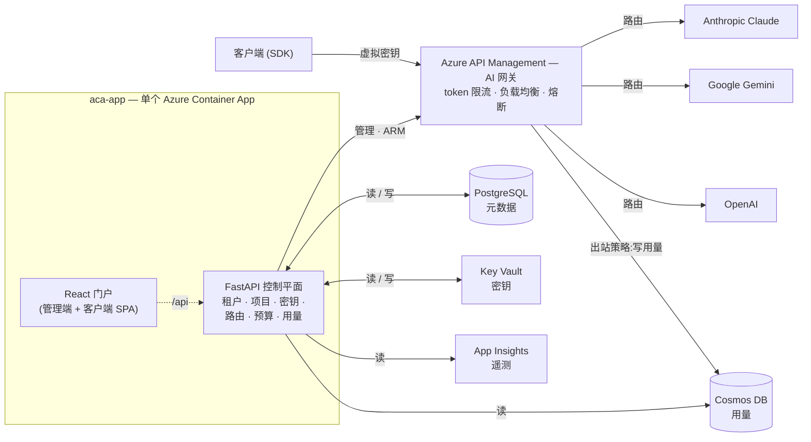

# Token Foundry

[English](README.md) | **中文**

Azure 原生的 LLM token 中枢 / AI 网关。在 Azure API Management 的 GenAI 网关之上构建的
混合控制平面 —— 多供应商(Anthropic Claude / Google Gemini / OpenAI)、按租户隔离的
虚拟密钥、token/成本计量,以及一个 React 门户。每个供应商都有自己独立的 APIM API,
沿用该供应商原生的订阅密钥请求头,因此供应商自家的 SDK 可以直接对着网关工作。

## 架构



> 全系统只有**一个** Cosmos DB。APIM 在每次调用时把一条用量记录*写*进去
> (出站策略);FastAPI 从**同一个**库里*读*出来给用量页 —— 这就是为什么
> 同一个节点既有一条写入箭头、又有一条读出箭头。精修版渲染图在
> [`docs/architecture.png`](docs/architecture.png);这张 Mermaid 图才是权威来源。

- **APIM = 数据平面** —— 鉴权、token 限流、路由、负载均衡 + 熔断,以及那条
  **每次调用直接把一条用量记录写进 Cosmos 的出站策略**(托管身份鉴权、
  `send-one-way-request`,所以绝不阻塞 LLM 响应)。
- **FastAPI = 控制平面** —— 只负责开通、计量、强制策略;从 Cosmos 读回用量、
  从 App Insights 读延迟;同时托管构建好的 SPA(一个镜像、一个 Container App、
  无需 nginx)。
- **React = 人机层** —— 运营控制台(管理端)+ 客户门户(客户端)。

### 用量是怎么采集的(计费链路)

在这条链路存在之前,门户的用量数字一直是 `0` —— 因为根本没有写入方。现在它是
一次直写就搞定:

1. 客户端带着虚拟密钥通过 APIM 调用某个供应商 API。
2. 响应成功时,APIM 的**出站策略**(`apim/policies/outbound-cosmos-write.xml`)
   往 Cosmos `usage` 容器 POST 一条文档 —— **供应商的原始响应 JSON** 加上元数据
   (请求 id、订阅/虚拟密钥 id、时间戳、API 名称、分区键)。写入时**不**解析 token,
   token 就留在 `raw_response` 里。
3. 控制平面在**读取**时才解析 token(`app/api/usage.py`),按各家格式处理
   (`prompt_tokens`/`completion_tokens`、Anthropic 与 OpenAI-Responses 的
   `input_tokens`/`output_tokens`、各种缓存 token 变体),并通过把记录里的
   虚拟密钥 id 与 PostgreSQL 比对(`虚拟密钥 → 项目 → 租户`)来确定该记录归属的租户。

这是一个有意为之的 MVP 取舍:`send-one-way-request` 是即发即忘,写入失败**不会重试**
(对趋势性用量来说偶尔丢失可以接受)。计费级、可重放的精确记账走下面的 Event Hub 链路 ——
该命名空间已开通但**尚未接通**(`worker/eventhub_consumer.py` 还是个 stub)。

### 用量页有两个数据源,分开展示

- **用量与成本 —— 来自 Cosmos**(计费源):每次调用的明细日志,含模型、项目/密钥、
  输入/输出/缓存 token。
- **调用与延迟 —— 来自 App Insights**(遥测,可能被采样):调用次数、p50/p95、
  **网关 vs 后端延迟拆分**(APIM 耗时 vs LLM 耗时)、失败数,以及每小时调用趋势。
  被采样的数据用于健康度/性能没问题,但**绝不能**用于计费 —— 这正是两个数据源
  分开的原因。

## 目录结构

```text
app/            FastAPI 控制平面(models / services / api)
worker/         Event Hub 消费者(第二阶段 —— stub,未接通)
portal/         React + Vite 前端
infra/          Bicep 基础设施即代码(main + lite + 模块 + Grafana 仪表盘)
apim/policies/  APIM 策略 XML(数据平面核心)
docs/           架构图
tests/          pytest(计费逻辑 —— 纯逻辑,不依赖 Azure)
```

## 基础设施(Bicep)

两个入口:

| 文件 | 部署什么 | 何时用 |
|---|---|---|
| `infra/main.lite.bicep` | Monitor、Key Vault、PostgreSQL、Cosmos、Event Hub、ACR | 快速首发 —— 先把便宜的数据 + 可观测层立起来,这样在 APIM 开通期间就能 `az acr build`。 |
| `infra/main.bicep` | lite 的全部**外加** APIM(约 30–45 分钟)、APIM 后端池、Grafana、应用密钥、Container App | 完整部署。 |

### 部署参数(传给 `main.bicep`)

这些是你在部署时**自己提供**的值,在 `infra/main.bicepparam`(非密钥)
或命令行(密钥)中定义:

| 参数 | 是否密钥 | 默认值 | 含义 |
|---|---|---|---|
| `namePrefix` | 否 | `tokenfoundry` | 所有资源名的前缀(如 `tokenfoundry-apim`)。全局唯一的资源(Cosmos / Key Vault / ACR)还会追加一段资源组 id 的哈希。 |
| `location` | 否 | `centralus` | 所有资源的 Azure 区域。**保持 `centralus`** —— 本订阅在某些区域(如 eastus)禁用 PostgreSQL;统一一个区域可避免跨区问题。 |
| `environmentName` | 否 | `dev` | 仅作标签(`dev` \| `prod`);打到每个资源上用于成本归集。 |
| `pgAdminLogin` | 否 | `tfadmin` | PostgreSQL 管理员用户名。 |
| `pgAdminPassword` | **是** | — | PostgreSQL 管理员密码。通过 `-p pgAdminPassword=$PG_PWD` 传入;**切勿**写死在 `.bicepparam` 里。会被拼进数据库连接串并存为 Key Vault 密钥(`tf-database-url`)。 |
| `jwtSecret` | **是** | — | 自托管登录 JWT 的 HS256 签名密钥。存为 `tf-jwt-secret`。 |
| `adminPassword` | **是** | — | 首次启动时创建的种子 `admin` 账号的密码。存为 `tf-admin-password`。 |
| `appImage` | 否 | 占位符 | Container App 运行的完整镜像引用,如 `<acr>.azurecr.io/tokenfoundry:v6`。先有鸡还是先有蛋:先部署 lite → `az acr build` → 设置此值 → 再部署完整版。 |

示例:

```bash
az deployment group create -g <rg> -f infra/main.bicep \
  -p infra/main.bicepparam \
  -p pgAdminPassword=$PG_PWD -p jwtSecret=$JWT -p adminPassword=$ADMIN_PWD \
  -p appImage=<acr>.azurecr.io/tokenfoundry:v6
```

### 各模块开通了什么(以及那些不显然的设置)

| 模块 | 资源 | 值得知道的点 |
|---|---|---|
| `monitor` | Log Analytics + App Insights | 工作区保留 30 天。App Insights 是用量页通过 KQL 查询的延迟/遥测源。 |
| `keyvault` | Key Vault | **RBAC 授权**(而非访问策略);软删除 7 天。各身份的角色在使用它的模块里授予。 |
| `postgres` | PostgreSQL Flexible Server 16 | `Standard_B1ms` 突发型,32 GB。防火墙规则 `AllowAzureServices`(0.0.0.0)让 Container Apps 能连上 —— 生产环境应收紧为 VNet。 |
| `cosmos` | Cosmos DB for NoSQL | **Serverless**,`disableLocalAuth: true`(仅 AAD —— 无密钥)。库 `tokenfoundry`,容器 `usage`,分区键 `/pk`(`subscriptionId_yyyymm`),原始文档 **90 天 TTL**。 |
| `eventhub` | Event Hub 命名空间 + `usage` hub | 为第二阶段计费流开通;**尚未接通**。Standard 层,2 分区,1 天保留,`billing` 消费者组。 |
| `acr` | 容器注册表(Basic) | `adminUserEnabled: false` —— 拉取走 Container App 的托管身份(AcrPull)。 |
| `apim` | API Management(Developer SKU) | 系统分配身份。配置 App Insights 的 **logger + diagnostic**(采样 **100%** —— 成本/细节的旋钮,见模块注释),并给自己的身份授予 **Cosmos Data Contributor**,使出站策略能写用量。 |
| `apim-backends` | 后端池 + 熔断器 | 使用**预览版** API 版本(Bicep 原生支持 —— 这正是我们选 Bicep 而非 Terraform 的原因)。占位池;真正的每供应商后端由 FastAPI provisioner 在运行时创建。 |
| `grafana` | Azure Managed Grafana | 系统身份被授予资源组级 **Monitoring Reader**,使仪表盘能出数(以前是手动步骤)。 |
| `appsecrets` | Key Vault 密钥 | 拼装 Postgres 连接串(让密码绝不落进应用设置),并写入 `tf-database-url` / `tf-jwt-secret` / `tf-admin-password`。 |
| `containerapps` | Container App(API + 门户) | 见下方身份/RBAC。 |

### 身份与 RBAC(谁能动什么)

Container App 有意使用**两个**身份:

- **用户分配身份(`*-acrpull-id`)** —— 在应用存在*之前*就被授予 AcrPull +
  Key Vault Secrets User,这样第一个修订版就能拉取镜像、解析密钥引用,而不会
  陷入先有鸡还是先有蛋的竞态。
- **系统分配身份** —— 运行时身份(`DefaultAzureCredential`)。运行时被授予:
  **APIM Service Contributor**(开通产品/订阅/后端)、**Key Vault Secrets Officer**
  (写订阅密钥 + BYO 密钥)、**Cosmos DB Data Contributor**(读用量 —— 数据平面
  RBAC,区别于控制平面),以及 App Insights 上的 **Monitoring Reader**(KQL 遥测)。

APIM 的系统身份另外被单独授予 **Cosmos DB Data Contributor**,用于出站策略的写入链路。

### 运行时配置(`TF_*` 环境变量)

`app/config.py` 读取这些变量(前缀 `TF_`);Container Apps 注入它们,密钥以
Key Vault 引用形式注入:

| 环境变量 | 来源 | 用途 |
|---|---|---|
| `TF_DATABASE_URL` | KV `tf-database-url` | PostgreSQL 的 SQLAlchemy URL。 |
| `TF_JWT_SECRET` | KV `tf-jwt-secret` | 签发自托管登录 JWT。 |
| `TF_ADMIN_USERNAME` / `TF_ADMIN_PASSWORD` | env / KV | 种子管理员凭据。 |
| `TF_COSMOS_ENDPOINT` | cosmos 模块 | 用量存储端点。 |
| `TF_APIM_SERVICE_NAME` | apim 模块 | 运行时开通的目标。 |
| `TF_APP_INSIGHTS_RESOURCE_ID` | monitor 模块 | 用量遥测 KQL 查询的目标资源。没有它,App Insights 区块会退化为空。 |
| `TF_RESOURCE_GROUP` / `TF_AZURE_SUBSCRIPTION_ID` | 部署时 | provisioner 的 ARM 作用域。 |
| `TF_ENVIRONMENT` | 静态 `prod` | 控制本地 dev-token 鉴权旁路是否开启。 |

## 运行(在 Dev Container 内)

在 Dev Container 中打开仓库(VS Code:"Reopen in Container")。它会安装
Python + Node + azure-cli(含 `az bicep`),并运行 `pip install -e .[dev]` 和
`npm install`。

### 1. 登录 Azure

```bash
az login
az account set --subscription <your-sub-id>
```

`DefaultAzureCredential`(后端)和 `az deployment`(Bicep)都复用这次登录。

### 2. 全面校验(无需云端)

```bash
# 后端:lint、类型检查、单元测试
ruff check app worker tests
mypy app
pytest -q

# 前端:类型检查 + 生产构建
cd portal && npm run typecheck && npm run build && cd ..

# Bicep:编译 + 对某个资源组做预演
az bicep build --file infra/main.bicep
az deployment group what-if -g <rg> -f infra/main.bicep \
  -p infra/main.bicepparam -p pgAdminPassword=<pwd>
```

### 3. 本地运行整套

```bash
# 后端(需要本地 Postgres,或让 TF_DATABASE_URL 指向一个)
cp .env.example .env          # 填好 TF_* 的值
uvicorn app.main:app --reload --port 8000

# 前端(另开一个终端)
cd portal
cp .env.example .env          # VITE_DEV_TOKEN=dev:admin: 本地管理员
npm run dev                   # http://localhost:5173,代理 /api -> :8000
```

本地鉴权使用一个 dev token(`dev:<role>:<tenant>`),后端仅在
`TF_ENVIRONMENT=local` 时接受 —— 无需 Entra 即可端到端跑通流程。

### 4. 部署

```bash
az group create -n <rg> -l centralus

# (可选)快速首发 —— 仅数据 + 可观测层
az deployment group create -g <rg> -f infra/main.lite.bicep \
  -p namePrefix=tokenfoundry -p pgAdminPassword=<pwd>

# 构建并推送单一镜像(根 Dockerfile 同时构建门户 + API)
az acr build -r <acr> -t tokenfoundry:v6 .

# 完整部署
az deployment group create -g <rg> -f infra/main.bicep \
  -p infra/main.bicepparam \
  -p pgAdminPassword=<pwd> -p jwtSecret=<jwt> -p adminPassword=<admin-pwd> \
  -p appImage=<acr>.azurecr.io/tokenfoundry:v6
```

后续仅更新应用时,跳过整套部署 —— 重新构建并滚动修订版即可:

```bash
az acr build -r <acr> -t tokenfoundry:v7 .
az containerapp update -g <rg> -n <prefix>-aca-app \
  --image <acr>.azurecr.io/tokenfoundry:v7
```

## 验证(端到端清单)

1. 在容器内 `az login`。
2. `az deployment group create …` —— APIM / PostgreSQL / Cosmos / Monitor /
   Grafana 起来;后端池 + 熔断器创建完成(预览版 API)。
3. 管理控制台 → 创建租户 + 项目 + 签发密钥 + 添加模型别名 → APIM 拿到
   产品/订阅/后端,密钥落进 Key Vault。
4. 用密钥调用某供应商 API(如 `POST {gateway}/llm-openai/v1/chat/completions`,
   虚拟密钥放在 `api-key` 请求头)→ 拿到补全;超过 TPM → 429。
5. 多供应商:改一下 body 里的 `model`,调用对应供应商路径 —— `claude-*`
   → `/llm-anthropic/v1/messages`(`x-api-key` 头),`gpt-5.x`
   → `/llm-openai/v1/responses`,其余 OpenAI/Gemini → `/v1/chat/completions`
   → 全部正确路由。
6. **用量页 → 选租户**:*Cosmos* 区块显示真实的输入/输出 token + 每次调用明细;
   *App Insights* 区块显示调用次数、p50/p95、网关 vs 后端拆分,以及每小时趋势。
7. Grafana 渲染跨租户的用量/成本/TPM。
8. 设个很小的预算 → `budget_enforcer` 暂停订阅 → 此后 401。
9. Azure Monitor 告警 → 预算阈值触发 Action Group。
10. 客户门户:客户只能看到自己的租户;跨租户访问被租户作用域中间件拒绝。

要端到端冒烟测试每个已登记模型,运行 `python scripts/smoke_test_models.py` ——
它会从控制平面自动发现模型,沿各自的供应商路径调用(把 `gpt-5.x` 路由到
Responses API),并打印一张通过/失败表。通过本地 `.env`(已 gitignore)配置网关
URL 和一个虚拟密钥;所需变量见脚本头部。

## 实现状态

- **当前可用:** 数据模型、控制平面 API + 租户作用域鉴权、APIM 开通服务、
  多供应商模型路由、管理端 + 客户端门户、覆盖全部 PaaS 的 Bicep、
  token 限流 + emit-token-metric 策略、**APIM→Cosmos 直写用量采集**、
  **双数据源用量页**(Cosmos 计费 + App Insights 延迟)、Grafana 仪表盘。
- **第二阶段(已开通,未接通):** 用于可重放/可重试记账的 Event Hub 计费 worker、
  语义缓存、BYO 凭据隔离、经由流的预算 $ 强制、成本分摊(chargeback)。
