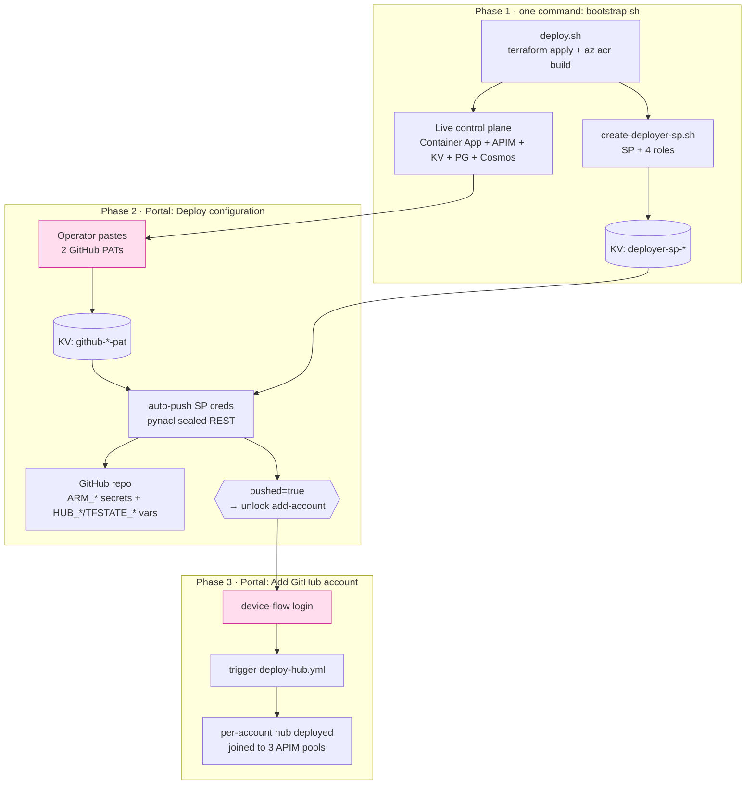

# Deployment

**English** | [中文](DEPLOYMENT.zh.md)

How to stand up a Token Foundry environment from nothing, and how the cloud-
automatic GitModel hub onboarding (方案 A) is wired afterwards. Every step is
grounded in the scripts under `scripts/` and the Terraform under `terraform/`.

## Overview — three phases




The only manual inputs (pink) are the two PATs and the device-flow login — GitHub
can't mint PATs via API, so a human pastes them once. Phase 1 is one command
(`bootstrap.sh`); Phase 2 and 3 are point-and-click in the Portal, no shell.

## Prerequisites

- `az login` with rights to: create resource groups, create service principals,
  assign roles at the subscription (Owner, or Contributor + User Access
  Administrator). Select the target subscription: `az account set --subscription <id>`.
- Tools in the dev container: `az`, `terraform`, `node`, Docker. (`gh` is **not**
  needed — the Portal pushes repo secrets via REST.)
- Two GitHub fine-grained PATs you generate yourself (see Phase 2).

## Phase 1 — bootstrap the environment

### 1a. Terraform configuration (what you set before running)

Terraform state is **local, isolated per environment via a workspace**. There is
no remote backend block — each environment lives in its own Terraform workspace
so their states never collide.

**Before deploying a NEW environment**, create + select its workspace:

```bash
cd terraform
terraform workspace new dev-a01      # creates AND switches to it (empty state)
terraform workspace show             # confirm you're on dev-a01
```

> Why this matters: the default/other workspaces hold other environments' state.
> If you run `apply` on the wrong workspace, Terraform sees the old resources and
> tries to *rename* them instead of creating fresh ones. Always confirm
> `terraform workspace show` before deploying.

Then set the environment's values in `terraform/terraform.tfvars`:

```hcl
name_prefix         = "tokenfoundry"
environment_name    = "dev"
resource_group_name = "tokenfoundry-rg-dev-a01"   # ← the only per-env name you pick
location            = "centralus"                # pick a region with capacity (see warning above)
pg_admin_login      = "tfadmin"

pg_admin_password = "<pg password>"     # sensitive — keep out of git
jwt_secret        = "<jwt signing secret>"
admin_password    = "<seed admin password>"

# APIM SKU. MUST be a v2 tier for token metering — token counting for the
# Anthropic Messages API and the GatewayLlmLogs diagnostic log category both
# require v2. The default (Developer_1) does NOT work for this project.
apim_sku = "StandardV2_1"
```

> ⚠️ **`apim_sku = "StandardV2_1"` is required, not optional.** On the default
> `Developer_1` SKU the `GatewayLlmLogs` log category doesn't exist (the
> `azurerm_monitor_diagnostic_setting.apim_llm_logs` apply fails) and Anthropic
> token metering doesn't work. Bonus: v2 APIM provisions in ~1–2 min vs the classic
> tier's 30–45 min.

**Resource names are derived, not hand-picked.** Every resource (Key Vault, APIM,
ACR, Container App, …) gets a suffix computed from the RG id:

```hcl
suffix = substr(md5(azurerm_resource_group.this.id), 0, 13)   # terraform/main.tf
```

So changing `resource_group_name` automatically changes every resource's suffix —
a brand-new environment can't collide with an old one's names (even soft-deleted
Key Vault / APIM残留), and you never edit per-resource names by hand.

> `terraform.tfvars` holds passwords in plaintext — it is **gitignored**. Never
> commit it. For a throwaway test env you may reuse an old env's passwords; for a
> real env generate fresh ones.

> ⚠️ **Region capacity is the #1 cause of deploy failures.** Different Azure
> regions hit different limits and they change over time. Observed on this project:
> - **`centralus`** — Container App env fails `ManagedEnvironmentCapacityHeavyUsageError` (AKS heavy usage).
> - **`norwayeast`** — Cosmos fails `ServiceUnavailable` (no zonal-redundant Cosmos quota).
> - **`eastus2`** — PostgreSQL fails `LocationIsOfferRestricted` (subscription can't provision Postgres there).
> - **`westus3`** — main env OK, but later out of AKS capacity for a per-account **hub** deploy.
> - **`southeastasia`** (Singapore) — the fallback that worked.
>
> The failing resource is usually the **Container App environment** (AKS-backed),
> then **Cosmos**, then **Postgres**. A failure on one of these is almost always
> capacity/quota, not a code bug — delete the RG, switch `location`, re-run. No
> single region is always available; be ready to try 2–3.

### 1b. Run bootstrap

```bash
az login && az account set --subscription <id>
./scripts/bootstrap.sh -g tokenfoundry-rg-dev-a01
```

`bootstrap.sh` runs two steps in order, stopping if the first fails:

1. **`deploy.sh`** — one `terraform apply` provisions the whole environment (RG,
   Key Vault, ACR, APIM, Cosmos, PostgreSQL, Container App control plane, tfstate
   storage). In parallel it builds two images with `az acr build`: the control-
   plane app (`tokenfoundry:<tag>`) and the pre-built GitModel hub
   (`gitmodel:<tag>`). On a v2 SKU (StandardV2_1) APIM provisions in ~1–2 min; the
   longer poles are then Postgres/Cosmos/Container App (a few minutes each).
   Ends with a `/healthz` smoke test.
2. **`create-deployer-sp.sh`** — creates the 方案 A deployment Service Principal,
   grants its role bundle, and writes its creds into Key Vault as `deployer-sp-*`
   secrets (see [SECURITY.md](SECURITY.md) for the exact roles + why).

Options forwarded through bootstrap: `-t <tag>`, `--skip-build` (to deploy.sh);
`-n <sp-name>`, `--reset-password`, `--no-uaa` (to create-deployer-sp.sh).

### 1c. What the control plane can now do

The Terraform-provisioned Container App is injected (no manual step) with the
env vars the Portal deploy-config flow needs — `TF_ACR_NAME`, `TF_ACR_LOGIN_SERVER`,
`TF_AZURE_LOCATION`, `TF_KEYVAULT_NAME`, `TF_TFSTATE_*`, `TF_GITHUB_*` — all from
`terraform/modules/containerapps/main.tf`. No runtime `az` query, no Terraform
state read at request time.

## Phase 2 — GitHub deploy configuration (Portal)

Open the Portal → **GitHub Accounts** → **Deploy configuration**. Paste two
fine-grained GitHub PATs (you generate them on GitHub):

| PAT | GitHub permission | Used for |
|---|---|---|
| **Bootstrap PAT** | repo Administration + Secrets: write | one-off: push the SP creds into this repo's Actions secrets + set repo variables |
| **Deploy PAT** | Actions: read + write | runtime: the control plane triggers + polls the `deploy-hub.yml` workflow |

Saving stores both in Key Vault (`github-bootstrap-pat`, `hub-deploy-github-token`)
and **auto-pushes** the SP creds (from KV `deployer-sp-*`) into the repo as
`ARM_*` Actions secrets plus `HUB_*` / `TFSTATE_*` Actions variables — the exact
inputs `deploy-hub.yml` reads. On success the **Add GitHub account** button
unlocks (gated on `deploy_pat_set AND pushed`).

The push uses `pynacl` to seal each secret with the repo's public key (GitHub
requires libsodium-encrypted secrets) — no `gh` CLI, pure REST
(`app/services/github_repo.py`, `app/api/deploy_config.py`).

## Phase 3 — add a GitHub account (Portal)

Portal → **GitHub Accounts** → **+ GitHub account**. A GitHub device-flow login
authorizes an account's Copilot subscription; the control plane then:

1. writes a per-account job-input secret to Key Vault,
2. triggers `deploy-hub.yml` (workflow_dispatch, the SP runs the hub Terraform),
3. polls the run, reads outputs (app_url, resource_group) from the remote-state
   blob, and
4. registers the hub into the openai/anthropic/google APIM pools with session
   affinity, then auto-registers its chat models as pooled routes.

See [方案 A architecture](architecture.md) for the full trigger/poll/state-read
chain.

> ⚠️ **The hub deploys to its own region, set independently of the main env.**
> `deploy-hub.yml` reads the region from the GitHub repo variable `HUB_LOCATION`,
> which the Portal's Phase-2 "Save & configure" sets from the main env's
> `TF_AZURE_LOCATION`. So a hub follows the main env's region **only if you
> (re-)run Phase 2 after deploying**. If Phase 2 was done against an old region,
> the hub still deploys there and can hit `ManagedEnvironmentCapacityHeavyUsageError`
> even though the main env deployed fine elsewhere. Always complete Phase 2 for the
> current environment before adding accounts.

> **If the model list is empty after the account goes `ready`:** the hub was still
> cold-starting when the control plane tried to read its `/api/models`, so catalog
> registration silently no-op'd. Click **Resync models** on the account row
> (Portal → GitHub Accounts) to re-run registration against the now-live hub. It's
> a two-way sync: adds new models, prunes retired platform routes.

> **Token metering / customMetrics note:** each LLM API gets an API-level App
> Insights diagnostic that MUST set `metrics=true` alongside `largeLanguageModel`
> (done in `apim_provisioner._ensure_api_llm_diagnostic`). Omitting `metrics`
> silently disables `emit-token-metric` (the Portal's Token breakdown + cached go
> empty) because an API-level diagnostic overrides the service-level one. See
> [customMetrics-diagnostic-troubleshooting.md](customMetrics-diagnostic-troubleshooting.md).

## Tearing down an environment

```bash
# 1. main RG + any per-account hub RGs (independent RGs!)
az group delete -n tokenfoundry-rg-dev-a01 --yes --no-wait
az group delete -n tokenfoundry-hub-<account_id> --yes --no-wait   # one per added account

# 2. the deployer SP
az ad app delete --id <deployer-sp-appId>

# 3. purge soft-deleted Key Vault + APIM so names free up for redeploy
az keyvault purge --name <kv-name>
az apim deletedservice purge --service-name <apim-name> --location <region>

# 4. remove the Terraform workspace (optional)
terraform workspace select default && terraform workspace delete dev-a01
```

> Key Vault and APIM have **soft-delete**; without `purge` they linger (7–90 days)
> and a redeploy that reuses the name fails. Since names are RG-derived, a
> *different* RG name avoids the collision anyway — but purge keeps the tenant
> clean.

## Verification checklist

- `curl https://<app-fqdn>/healthz` → `{"status":"ok"}`
- Portal loads; GitHub Accounts page shows **Deploy configuration** = *Not configured*.
- After Phase 2: repo Settings → Secrets shows `ARM_CLIENT_ID/SECRET/TENANT_ID/SUBSCRIPTION_ID`; Variables show `HUB_*` / `TFSTATE_*`.
- After Phase 3: a hub run appears in GitHub Actions and succeeds; the account goes READY; model routes appear.
