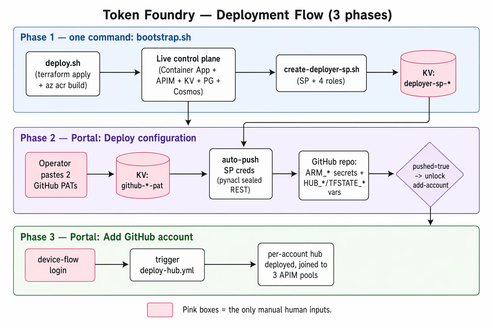
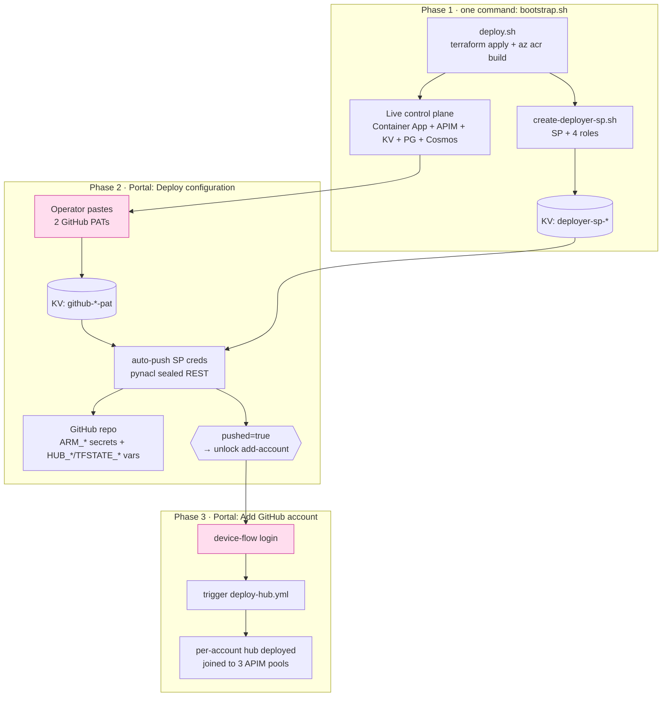

# Deployment

**English** | [中文](DEPLOYMENT.zh.md)

How to stand up a Token Foundry environment from nothing, and how the cloud-
automatic GitModel hub onboarding (方案 A) is wired afterwards. Every step is
grounded in the scripts under `scripts/` and the Terraform under `terraform/`.

## Overview — three phases




```mermaid
flowchart TB
    subgraph p1[Phase 1 · one command: bootstrap.sh]
        DEP[deploy.sh<br/>terraform apply + az acr build] --> CP[Live control plane<br/>Container App + APIM + KV + PG + Cosmos]
        DEP --> SP[create-deployer-sp.sh<br/>SP + 4 roles]
        SP --> KVSP[(KV: deployer-sp-*)]
    end
    subgraph p2[Phase 2 · Portal: Deploy configuration]
        PAT[Operator pastes<br/>2 GitHub PATs] --> STORE[(KV: github-*-pat)]
        STORE --> PUSH[auto-push SP creds<br/>pynacl sealed REST]
        KVSP --> PUSH
        PUSH --> REPO[GitHub repo<br/>ARM_* secrets + HUB_*/TFSTATE_* vars]
        PUSH --> GATE{{pushed=true<br/>→ unlock add-account}}
    end
    subgraph p3[Phase 3 · Portal: Add GitHub account]
        DEV[device-flow login] --> DISPATCH[trigger deploy-hub.yml]
        DISPATCH --> HUB[per-account hub deployed<br/>joined to 3 APIM pools]
    end
    CP --> PAT
    GATE --> DEV

    classDef manual fill:#fde,stroke:#c39
    class PAT,DEV manual
```

The only manual inputs (pink) are the two PATs and the device-flow login — GitHub
can't mint PATs via API, so a human pastes them once. Phase 1 is one command
(`bootstrap.sh`); Phase 2 and 3 are point-and-click in the Portal, no shell.

## Prerequisites

- `az login` with rights to: create resource groups, create service principals,
  assign roles at the subscription (Owner, or Contributor + User Access
  Administrator). Select the target subscription: `az account set --subscription <id>`.
- Tools in the dev container: `az`, `terraform`, `node`, Docker. (`gh` is **not**
  needed — the Portal pushes repo secrets via REST.)
- Two GitHub fine-grained PATs you generate yourself (see Phase 2).

## Phase 1 — bootstrap the environment

### 1a. Terraform configuration (what you set before running)

Terraform state is **local, isolated per environment via a workspace**. There is
no remote backend block — each environment lives in its own Terraform workspace
so their states never collide.

**Before deploying a NEW environment**, create + select its workspace:

```bash
cd terraform
terraform workspace new dev-a01      # creates AND switches to it (empty state)
terraform workspace show             # confirm you're on dev-a01
```

> Why this matters: the default/other workspaces hold other environments' state.
> If you run `apply` on the wrong workspace, Terraform sees the old resources and
> tries to *rename* them instead of creating fresh ones. Always confirm
> `terraform workspace show` before deploying.

Then set the environment's values in `terraform/terraform.tfvars`:

```hcl
name_prefix         = "tokenfoundry"
environment_name    = "dev"
resource_group_name = "tokenfoundry-rg-dev-a01"   # ← the only per-env name you pick
location            = "centralus"                # pick a region with capacity (see warning above)
pg_admin_login      = "tfadmin"

pg_admin_password = "<pg password>"     # sensitive — keep out of git
jwt_secret        = "<jwt signing secret>"
admin_password    = "<seed admin password>"

# APIM SKU. MUST be a v2 tier for token metering — token counting for the
# Native Anthropic Messages API token metering is available only on the v2
# tiers. The default Developer_1 does not work for this project.
apim_sku = "StandardV2_1"

# GitHub repo hosting deploy-hub.yml (方案 A hub deploys). Optional — defaults to
# Nick287/TokenFoundry. Set these to point the control plane at a different
# fork/org: it pushes the deployer SP creds into THIS repo's Actions secrets and
# triggers its deploy-hub.yml. The PATs you paste in Phase 2 must belong to an
# account with admin rights on this repo.
# github_repo_owner = "your-org"
# github_repo_name  = "your-repo"

# --- The four below all have defaults; a new environment rarely sets them ---

# Cosmos throughput. 0 = serverless, the default, and right for almost everything.
# ⚠️ CREATION-TIME ONLY, and terraform's plan will not tell you: azurerm treats
# `capabilities` as computed, so changing this on an existing environment produces
# no diff at all — the plan looks benign and the apply fails on Azure's side. An
# environment already built provisioned must pin its own value.
# cosmos_throughput_rus = 0

# APIM telemetry sampling (0-100). 100 = every call, the default, and what exact
# reconciliation depends on. Lowering it makes the ledger approximate (its left
# side comes from `requests`, its right side from Cosmos).
# 0 is a distinct posture rather than merely "very low": combined with
# alwaysLog=allErrors — written into every API diagnostic — it means "successes
# not logged, every failure logged, token metering untouched".
# apim_sampling_percentage = 100

# Ingestion sampling on the App Insights component. LEAVE AT 100; changing it is
# likely inert. The APIM diagnostic always sends samplingType=fixed, and Azure
# disables ingestion sampling for a type that already has fixed-rate sampling.
# Declared mainly so it is FINDABLE — it was running on an implicit default.
# app_insights_sampling_percentage = 100

# Log Analytics retention in days (30-730). LOWERING IT SAVES NOTHING: the first
# 31 days are included in the ingestion price. Azure's wording — "lowering the
# retention period below 31 days does not reduce costs". To spend less on logs,
# ingest less.
# log_retention_days = 30
```

> ⚠️ **`apim_sku = "StandardV2_1"` is required, not optional.** The classic
> tiers (Developer / Basic / Standard / Premium) do **not** support native
> Anthropic Messages API token metering, which is the point of this project. A
> side benefit: a v2 APIM builds in 1-2 minutes against 30-45 for classic.
>
> That speed-up had a consequence worth knowing about. `deploy.sh` used to run
> the whole apply in the background and build both images alongside it, on the
> reasoning that the Container App sits behind APIM's 30+ minutes and the build
> would long since have finished. At 1m32s it does not, and the app image takes
> ~7 minutes (it builds the React portal with node first) — so the apply reached
> the Container App with the tag unpushed and Azure refused it with
> `MANIFEST_UNKNOWN`, leaving an app that `terraform import` will not adopt. The
> script now applies the ACR alone, blocks on the app image, then applies the
> rest.
>
> The value is `<tier>_<capacity>`. A bare `StandardV2` is rejected by the
> provider (`not a valid Api Management sku name`) and only at plan time.
>
> An earlier version of this note blamed the `GatewayLlmLogs` category missing
> on Developer_1. That diagnostic setting was removed entirely on 2026-08-15
> (it duplicated `AppRequests` row for row and nothing read it), so that reason
> no longer applies. **Same conclusion, different reason.**

⚠️ It packages the WORKING TREE, not git HEAD. Uncommitted changes do ship; and
a file showing `M` in `git status` is not evidence that it has not been
deployed. To see what is actually running, read the image tag.

---

## Updating an existing environment

> This section is fuller in [DEPLOYMENT.zh.md](DEPLOYMENT.zh.md), which the
> project keeps as the primary version. The two traps below are the ones that
> cost the most time, so they are repeated here.

Configuration is written at several unrelated moments and "change the code,
rebuild the image" covers only one of them. See
[`CHANGELOG.zh.md`](../CHANGELOG.zh.md), where every entry states what it takes
to make it real on an existing environment, and
`python scripts/check_env.py -g <rg>`, which compares what an environment has
against what the current code expects.

### ⚠️ Rebuilding the hub image is not the same as a hub running it

A hub is not part of the control plane. Each GitHub account gets its own
Container App, in its own resource group, deployed by the `deploy-hub` GitHub
Action. So a change under `vendored/gitmodel-hub/` takes two steps:

1. **Rebuild the hub image** (`deploy.sh` does, or
   `az acr build -r <acr> -t gitmodel:<tag> vendored/gitmodel-hub`)
2. **Re-run the `deploy-hub` workflow for every account** (`action=apply`)

Stop after step 1 and the image sits in the registry with nothing pulling it:
existing hubs keep running the old code, and **nothing anywhere says so**. The
`copilot_usage` redaction of 2026-09-02 is exactly this shape — the change lives
entirely in the hub, so updating the control-plane image achieves nothing.

`check_env.py`'s layer 6 reports each hub's running image against the newest tag
in the registry.

### ⚠️ APIM policies and per-API diagnostics are written by neither

They are not terraform resources and do not ship with an image. The control
plane writes them when an account is added or when an operator presses **resync
models** in the portal — the `llm-*` APIs are created at runtime, so terraform
cannot know their names at apply time.

The consequence: change policy-related code, deploy it, and **the existing APIs
are still the old ones** until somebody presses that button. A customer reported
a streaming bug in 2026-08 whose fix had shipped weeks earlier, for exactly this
reason.

---

## Tearing down an environment

```bash
# 1. main RG + any per-account hub RGs (independent RGs!)
az group delete -n tokenfoundry-rg-dev-a01 --yes --no-wait
az group delete -n tokenfoundry-hub-<account_id> --yes --no-wait   # one per added account

# 2. the deployer SP
az ad app delete --id <deployer-sp-appId>

# 3. purge soft-deleted Key Vault + APIM so names free up for redeploy
az keyvault purge --name <kv-name>
az apim deletedservice purge --service-name <apim-name> --location <region>

# 4. remove the Terraform workspace (optional)
terraform workspace select default && terraform workspace delete dev-a01
```

> Key Vault and APIM have **soft-delete**; without `purge` they linger (7–90 days)
> and a redeploy that reuses the name fails. Since names are RG-derived, a
> *different* RG name avoids the collision anyway — but purge keeps the tenant
> clean.

## Verification checklist

- `curl https://<app-fqdn>/healthz` → `{"status":"ok"}`
- Portal loads; GitHub Accounts page shows **Deploy configuration** = *Not configured*.
- After Phase 2: repo Settings → Secrets shows `ARM_CLIENT_ID/SECRET/TENANT_ID/SUBSCRIPTION_ID`; Variables show `HUB_*` / `TFSTATE_*`.
- After Phase 3: a hub run appears in GitHub Actions and succeeds; the account goes READY; model routes appear.
