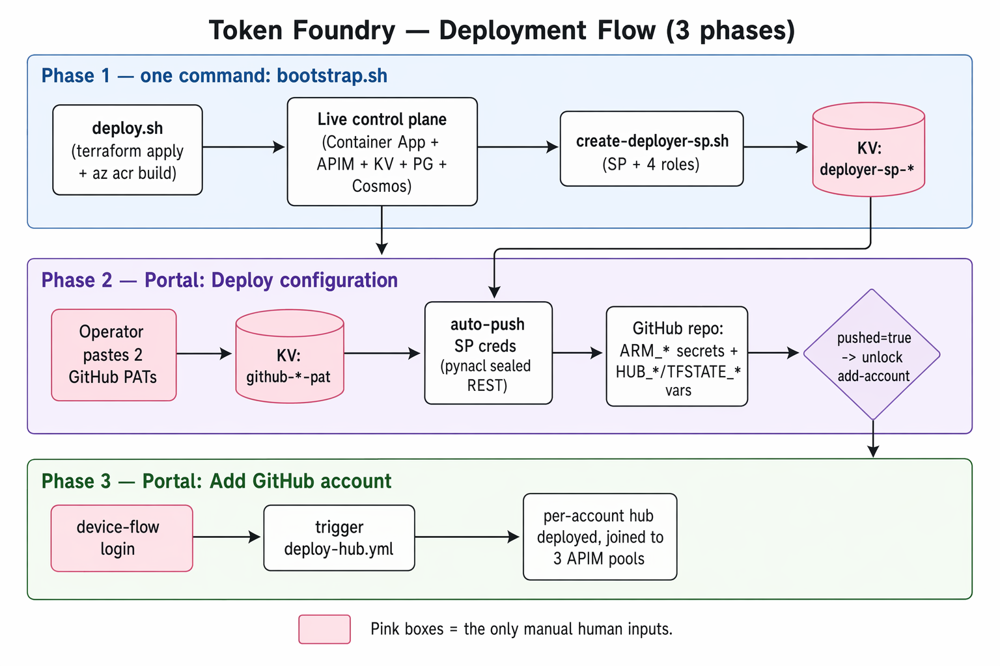
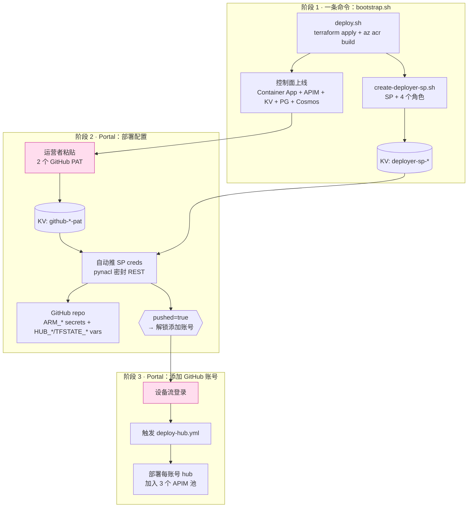

# 部署

[English](DEPLOYMENT.md) | **中文**

如何从零搭起一个 Token Foundry 环境，以及之后云端自动的 GitModel hub 接入（方案 A）
如何配置。每一步都以 `scripts/` 下的脚本和 `terraform/` 下的配置为准。

## 总览 — 三个阶段





唯一需要人工输入的（粉色）是两个 PAT 和设备流登录——GitHub 不支持 API 生成 PAT，所以需要
人工粘贴一次。阶段 1 是一条命令（`bootstrap.sh`）；阶段 2、3 在 Portal 里点点即可，无需 shell。

## 前置条件

- `az login`，需具备：创建资源组、创建服务主体、在订阅级分配角色的权限（Owner，或
  Contributor + User Access Administrator）。选中目标订阅：`az account set --subscription <id>`。
- 开发容器内工具：`az`、`terraform`、`node`、Docker。（**不需要** `gh` —— Portal
  用 REST 推送 repo secrets。）
- 两个你自己在 GitHub 生成的细粒度 PAT（见阶段 2）。

## 阶段 1 — bootstrap 部署环境

### 1a. Terraform 配置（运行前要设的）

Terraform state 是**本地的、按 workspace 逐环境隔离**。没有远程 backend 块——每个环境
在自己的 Terraform workspace 里，state 互不冲突。

**部署新环境前**，先建 + 选中它的 workspace：

```bash
cd terraform
terraform workspace new dev-a01      # 创建并切换过去（空 state）
terraform workspace show             # 确认当前在 dev-a01
```

> 为什么重要：default 或其他 workspace 存着别的环境的 state。如果在错的 workspace 上跑
> `apply`，Terraform 会看到旧资源、试图**重命名**而不是新建。部署前务必确认
> `terraform workspace show`。

然后在 `terraform/terraform.tfvars` 里设环境的值：

```hcl
name_prefix         = "tokenfoundry"
environment_name    = "dev"
resource_group_name = "tokenfoundry-rg-dev-a01"   # ← 唯一需要你挑的按环境命名
location            = "centralus"                 # 选一个有容量的区域（见下方警告）
pg_admin_login      = "tfadmin"

pg_admin_password = "<pg 密码>"          # 敏感 —— 不入 git
jwt_secret        = "<jwt 签名密钥>"
admin_password    = "<种子 admin 密码>"

# APIM SKU。token 计量必须用 v2 tier —— Anthropic Messages API 的 token 计数、
# 以及 GatewayLlmLogs 诊断日志类别都需要 v2。默认的 Developer_1 不适用本项目。
apim_sku = "StandardV2_1"
```

> ⚠️ **`apim_sku = "StandardV2_1"` 是必需的，不是可选。** 默认 `Developer_1` SKU 下
> `GatewayLlmLogs` 日志类别不存在（`azurerm_monitor_diagnostic_setting.apim_llm_logs`
> apply 会失败），Anthropic token 计量也不工作。附带好处：v2 APIM 约 1–2 分钟建成，
> 而经典 tier 要 30–45 分钟。

**资源名是派生的，不是手挑的。** 每个资源（Key Vault、APIM、ACR、Container App…）的
后缀由 RG id 计算：

```hcl
suffix = substr(md5(azurerm_resource_group.this.id), 0, 13)   # terraform/main.tf
```

所以改 `resource_group_name` 会自动改掉每个资源的后缀——全新环境不可能撞上旧环境的名字
（连软删除的 Key Vault / APIM 残留也不撞），而且你永远不用手改单个资源名。

> `terraform.tfvars` 里密码是明文——它**已 gitignored**。绝不提交。临时测试环境可复用
> 旧环境密码；正式环境请生成新的。

> ⚠️ **区域容量是部署失败的头号原因。** 不同 Azure 区域各有不同限制，且会随时间变化。
> 本项目实测遇到的：
> - **`centralus`** — Container App 环境失败 `ManagedEnvironmentCapacityHeavyUsageError`（AKS 容量不足）。
> - **`norwayeast`** — Cosmos 失败 `ServiceUnavailable`（订阅无可用区冗余 Cosmos 配额）。
> - **`eastus2`** — PostgreSQL 失败 `LocationIsOfferRestricted`（订阅不允许在此建 Postgres）。
> - **`westus3`** — 主环境 OK，但后来每账号 **hub** 部署时 AKS 容量不足。
> - **`southeastasia`**（新加坡）— 兜底可用的区。
>
> 失败的资源通常是 **Container App 环境**（AKS 支撑），其次 **Cosmos**，再次 **Postgres**。
> 这几个失败几乎都是容量/配额问题，不是代码 bug —— 删掉 RG、换 `location`、重跑。没有
> 任何一个区永远可用；要准备好试 2–3 个。

### 1b. 运行 bootstrap

```bash
az login && az account set --subscription <id>
./scripts/bootstrap.sh -g tokenfoundry-rg-dev-a01
```

`bootstrap.sh` 按序跑两步，第一步失败就停：

1. **`deploy.sh`** —— 一次 `terraform apply` 建整个环境（RG、Key Vault、ACR、APIM、
   Cosmos、PostgreSQL、控制面 Container App、tfstate 存储）。并行用 `az acr build` 建两个
   镜像：控制面 app（`tokenfoundry:<tag>`）和预建的 GitModel hub（`gitmodel:<tag>`）。v2 SKU
   （StandardV2_1）下 APIM 约 1–2 分钟建成；之后较长的是 Postgres/Cosmos/Container App（各几分钟）。
   结尾做 `/healthz` smoke test。
2. **`create-deployer-sp.sh`** —— 创建方案 A 的部署服务主体，授予其角色包，并把 creds
   写进 Key Vault 的 `deployer-sp-*` secret（确切角色 + 原因见 [SECURITY.zh.md](SECURITY.zh.md)）。

bootstrap 透传的选项：`-t <tag>`、`--skip-build`（给 deploy.sh）；`-n <sp-name>`、
`--reset-password`、`--no-uaa`（给 create-deployer-sp.sh）。

### 1c. 此时控制面能做什么

Terraform 建的 Container App 被注入了（无需手动）Portal 部署配置流程所需的 env：
`TF_ACR_NAME`、`TF_ACR_LOGIN_SERVER`、`TF_AZURE_LOCATION`、`TF_KEYVAULT_NAME`、
`TF_TFSTATE_*`、`TF_GITHUB_*`，全部来自 `terraform/modules/containerapps/main.tf`。
请求时无需运行时 `az` 查询、无需读 Terraform state。

## 阶段 2 — GitHub 部署配置（Portal）

打开 Portal → **GitHub 账号** → **部署配置**。粘贴两个细粒度 GitHub PAT（你在 GitHub 生成）：

| PAT | GitHub 权限 | 用途 |
|---|---|---|
| **Bootstrap PAT** | repo Administration + Secrets：写 | 一次性：把 SP creds 推成本仓库的 Actions secrets + 设 repo variables |
| **Deploy PAT** | Actions：读+写 | 运行时：控制面触发+轮询 `deploy-hub.yml` 工作流 |

保存会把两个都存入 Key Vault（`github-bootstrap-pat`、`hub-deploy-github-token`），并
**自动推送** SP creds（来自 KV `deployer-sp-*`）成 repo 的 `ARM_*` Actions secrets，外加
`HUB_*` / `TFSTATE_*` Actions variables —— 正是 `deploy-hub.yml` 读取的输入。成功后
**添加 GitHub 账号** 按钮解锁（gate 条件 `deploy_pat_set AND pushed`）。

推送用 `pynacl` 以仓库公钥密封每个 secret（GitHub 要求 libsodium 加密的 secret）——不用
`gh` CLI，纯 REST（`app/services/github_repo.py`、`app/api/deploy_config.py`）。

## 阶段 3 — 添加 GitHub 账号（Portal）

Portal → **GitHub 账号** → **+ GitHub 账号**。一次 GitHub 设备流登录授权该账号的 Copilot
订阅；控制面随后：

1. 写一个每账号 job-input secret 到 Key Vault，
2. 触发 `deploy-hub.yml`（workflow_dispatch，SP 跑 hub Terraform），
3. 轮询 run，从远程 state blob 读输出（app_url、resource_group），
4. 把 hub 以会话粘性注册进 openai/anthropic/google 三个 APIM 池，再自动把它的 chat 模型
   注册成池化路由。

完整的触发/轮询/读 state 链见 [方案 A 架构](architecture.md)。

> ⚠️ **hub 部署到它自己的区域，且独立于主环境设置。** `deploy-hub.yml` 从 GitHub repo
> 变量 `HUB_LOCATION` 读区域，而这个变量是 Portal 阶段 2 的 "Save & configure" 从主环境的
> `TF_AZURE_LOCATION` 设的。所以 **只有你（重新）跑了阶段 2，hub 才会跟随当前主环境的区域**。
> 若阶段 2 是对着旧区域做的，hub 仍会部署到那个旧区，即使主环境在别处部署成功，也可能撞
> `ManagedEnvironmentCapacityHeavyUsageError`。**添加账号前，务必对当前环境完成阶段 2。**

> **账号变 `ready` 后模型列表却是空的：** 说明控制平面去读 hub 的 `/api/models` 时 hub 还在
> 冷启动，catalog 注册静默跳过了。到 Portal → GitHub Accounts，点账号行上的 **Resync models**
> 对已就绪的 hub 重跑注册。它是双向同步：新增新模型、清理已下架的平台路由。

> **token 计量 / customMetrics 注意：** 每个 LLM API 会配一个 API 级 App Insights 诊断，它
> **必须同时设 `metrics=true` 和 `largeLanguageModel`**（在 `apim_provisioner._ensure_api_llm_diagnostic`
> 里做）。漏掉 `metrics` 会静默关闭 `emit-token-metric`（Portal 的 Token 细分 + cached 变空），
> 因为 API 级诊断会 override 服务级诊断。详见
> [customMetrics-diagnostic-troubleshooting.md](customMetrics-diagnostic-troubleshooting.md)。

## 销毁环境

```bash
# 1. 主 RG + 任何每账号 hub RG（独立 RG！）
az group delete -n tokenfoundry-rg-dev-a01 --yes --no-wait
az group delete -n tokenfoundry-hub-<account_id> --yes --no-wait   # 每加一个账号一个

# 2. 部署 SP
az ad app delete --id <deployer-sp-appId>

# 3. purge 软删除的 Key Vault + APIM，让名字释放以便重部署
az keyvault purge --name <kv-name>
az apim deletedservice purge --service-name <apim-name> --location <region>

# 4. 删除 Terraform workspace（可选）
terraform workspace select default && terraform workspace delete dev-a01
```

> Key Vault 和 APIM 有**软删除**；不 purge 会残留（7–90 天），重部署复用同名会失败。因为
> 名字是 RG 派生的，换个 *不同* 的 RG 名本就不撞——但 purge 能保持租户干净。

## 验证清单

- `curl https://<app-fqdn>/healthz` → `{"status":"ok"}`
- Portal 能加载；GitHub 账号页显示 **部署配置** = *未配置*。
- 阶段 2 后：repo Settings → Secrets 出现 `ARM_CLIENT_ID/SECRET/TENANT_ID/SUBSCRIPTION_ID`；Variables 出现 `HUB_*` / `TFSTATE_*`。
- 阶段 3 后：GitHub Actions 出现一次 hub run 并成功；账号变 READY；模型路由出现。
