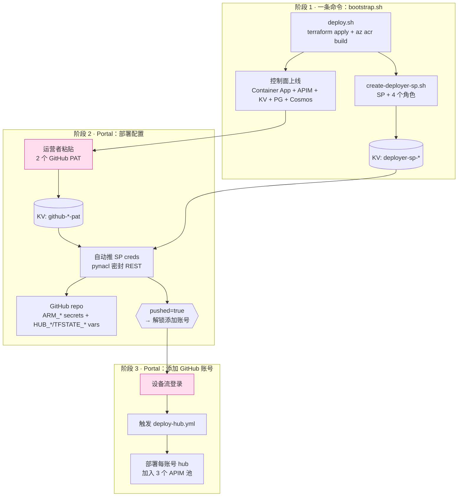

# 部署

[English](DEPLOYMENT.md) | **中文**

如何从零搭起一个 Token Foundry 环境，以及之后云端自动的 GitModel hub 接入（方案 A）
如何配置。每一步都以 `scripts/` 下的脚本和 `terraform/` 下的配置为准。

## 总览 — 三个阶段



```mermaid
flowchart TB
    subgraph p1[阶段 1 · 一条命令：bootstrap.sh]
        DEP[deploy.sh<br/>terraform apply + az acr build] --> CP[控制面上线<br/>Container App + APIM + KV + PG + Cosmos]
        DEP --> SP[create-deployer-sp.sh<br/>SP + 4 个角色]
        SP --> KVSP[(KV: deployer-sp-*)]
    end
    subgraph p2[阶段 2 · Portal：部署配置]
        PAT[运营者粘贴<br/>2 个 GitHub PAT] --> STORE[(KV: github-*-pat)]
        STORE --> PUSH[自动推 SP creds<br/>pynacl 密封 REST]
        KVSP --> PUSH
        PUSH --> REPO[GitHub repo<br/>ARM_* secrets + HUB_*/TFSTATE_* vars]
        PUSH --> GATE{{pushed=true<br/>→ 解锁添加账号}}
    end
    subgraph p3[阶段 3 · Portal：添加 GitHub 账号]
        DEV[设备流登录] --> DISPATCH[触发 deploy-hub.yml]
        DISPATCH --> HUB[部署每账号 hub<br/>加入 3 个 APIM 池]
    end
    CP --> PAT
    GATE --> DEV

    classDef manual fill:#fde,stroke:#c39
    class PAT,DEV manual
```

唯一需要人工输入的（粉色）是两个 PAT 和设备流登录——GitHub 不支持 API 生成 PAT，所以需要
人工粘贴一次。阶段 1 是一条命令（`bootstrap.sh`）；阶段 2、3 在 Portal 里点点即可，无需 shell。

## 前置条件

- `az login`，需具备：创建资源组、创建服务主体、在订阅级分配角色的权限（Owner，或
  Contributor + User Access Administrator）。选中目标订阅：`az account set --subscription <id>`。
- 开发容器内工具：`az`、`terraform`、`node`、Docker。（**不需要** `gh` —— Portal
  用 REST 推送 repo secrets。）
- 两个你自己在 GitHub 生成的细粒度 PAT（见阶段 2）。

## 阶段 1 — bootstrap 部署环境

### 1a. Terraform 配置（运行前要设的）

Terraform state 是**本地的、按 workspace 逐环境隔离**。没有远程 backend 块——每个环境
在自己的 Terraform workspace 里，state 互不冲突。

**部署新环境前**，先建 + 选中它的 workspace：

```bash
cd terraform
terraform workspace new dev-a01      # 创建并切换过去（空 state）
terraform workspace show             # 确认当前在 dev-a01
```

> 为什么重要：default 或其他 workspace 存着别的环境的 state。如果在错的 workspace 上跑
> `apply`，Terraform 会看到旧资源、试图**重命名**而不是新建。部署前务必确认
> `terraform workspace show`。

然后在 `terraform/terraform.tfvars` 里设环境的值：

```hcl
name_prefix         = "tokenfoundry"
environment_name    = "dev"
resource_group_name = "tokenfoundry-rg-dev-a01"   # ← 唯一需要你挑的按环境命名
location            = "centralus"                 # 选一个有容量的区域（见下方警告）
pg_admin_login      = "tfadmin"

pg_admin_password = "<pg 密码>"          # 敏感 —— 不入 git
jwt_secret        = "<jwt 签名密钥>"
admin_password    = "<种子 admin 密码>"

# APIM SKU。token 计量必须用 v2 tier —— Anthropic 原生 Messages API 的 token
# 计量只在 v2 层可用。默认的 Developer_1 不适用本项目。
apim_sku = "StandardV2_1"

# 承载 deploy-hub.yml 的 GitHub 仓库（方案 A 的 hub 部署）。可选 —— 默认
# Nick287/TokenFoundry。设置它可让控制面指向另一个 fork/组织：控制面会把部署 SP 凭据
# 推进「这个仓库」的 Actions secrets 并触发它的 deploy-hub.yml。阶段 2 粘贴的 PAT
# 必须属于对该仓库有管理权限的账号。
# github_repo_owner = "your-org"
# github_repo_name  = "your-repo"

# --- 以下四个都有默认值，新环境通常不用写 ---

# Cosmos 吞吐。0 = serverless，就是默认值，绝大多数情况下是对的。
# ⚠️ 这是**创建时固定**的选择，而且 terraform 的 plan 不会警告你：azurerm 把
# capabilities 当作 computed，改这个值对已有环境**不产生任何 diff**，plan 看起来
# 人畜无害，apply 在 Azure 侧才失败。已按预配建出来的环境必须显式钉住自己的值。
# cosmos_throughput_rus = 0

# APIM 遥测采样（0–100）。100 = 每次调用都记，是默认值，也是精确对账的前提。
# 降低它会让闭合式失去精确性（左边取自 requests，右边取自 Cosmos）。
# 0 是一个**有意义的档位**而不只是"很低"：配合 alwaysLog=allErrors（每个 API 诊断
# 都会写），0 表示「成功不记、失败全记、token 计量完整保留」。
# apim_sampling_percentage = 100

# App Insights 组件侧的摄入采样。**保持 100，改它很可能无效**：APIM 诊断始终发
# samplingType=fixed，而 Azure 文档说已有固定速率采样的类型会禁用摄入采样。
# 声明它主要是为了「找得到」——它本来就在那里跑着隐式默认值。
# app_insights_sampling_percentage = 100

# Log Analytics 保留天数（30–730）。**降低它省不到钱**：前 31 天的保留已含在摄入
# 价里，Azure 原话是 "lowering the retention period below 31 days does not reduce
# costs"。要省日志钱只能减少**摄入量**。
# log_retention_days = 30
```

> ⚠️ **`apim_sku = "StandardV2_1"` 是必需的，不是可选。** 经典层
> （Developer / Basic / Standard / Premium）**不支持 Anthropic 原生 Messages API 的
> token 计量**，而那是本项目的核心能力。附带好处：v2 APIM 约 1–2 分钟建成，
> 经典 tier 要 30–45 分钟。
>
> 注意值的格式是 `<层级>_<容量>`：写成 `StandardV2` 会被 provider 拒绝
> （`not a valid Api Management sku name`），而且只在 plan 时才报出来。
>
> 旧版本这里还写着"Developer_1 下 GatewayLlmLogs 类别不存在导致 apply 失败"——
> 该诊断设置已于 2026-08-15 整个删除（它与 `AppRequests` 逐行重复且无人读取），
> 所以那条理由不再适用。**结论没变，理由变了。**

**资源名是派生的，不是手挑的。** 每个资源（Key Vault、APIM、ACR、Container App…）的
后缀由 RG id 计算：

```hcl
suffix = substr(md5(azurerm_resource_group.this.id), 0, 13)   # terraform/main.tf
```

所以改 `resource_group_name` 会自动改掉每个资源的后缀——全新环境不可能撞上旧环境的名字
（连软删除的 Key Vault / APIM 残留也不撞），而且你永远不用手改单个资源名。

> `terraform.tfvars` 里密码是明文——它**已 gitignored**。绝不提交。临时测试环境可复用
> 旧环境密码；正式环境请生成新的。

> ⚠️ **区域容量是部署失败的头号原因。** 不同 Azure 区域各有不同限制，且会随时间变化。
> 本项目实测遇到的：
> - **`centralus`** — Container App 环境失败 `ManagedEnvironmentCapacityHeavyUsageError`（AKS 容量不足）。
> - **`norwayeast`** — Cosmos 失败 `ServiceUnavailable`（订阅无可用区冗余 Cosmos 配额）。
> - **`eastus2`** — PostgreSQL 失败 `LocationIsOfferRestricted`（订阅不允许在此建 Postgres）。
> - **`westus3`** — 主环境 OK，但后来每账号 **hub** 部署时 AKS 容量不足。
> - **`southeastasia`**（新加坡）— 兜底可用的区。
>
> 失败的资源通常是 **Container App 环境**（AKS 支撑），其次 **Cosmos**，再次 **Postgres**。
> 这几个失败几乎都是容量/配额问题，不是代码 bug —— 删掉 RG、换 `location`、重跑。没有
> 任何一个区永远可用；要准备好试 2–3 个。

### 1b. 运行 bootstrap

```bash
az login && az account set --subscription <id>
./scripts/bootstrap.sh -g tokenfoundry-rg-dev-a01
```

`bootstrap.sh` 按序跑两步，第一步失败就停：

1. **`deploy.sh`** —— 一次 `terraform apply` 建整个环境（RG、Key Vault、ACR、APIM、
   Cosmos、PostgreSQL、控制面 Container App、tfstate 存储）。并行用 `az acr build` 建两个
   镜像：控制面 app（`tokenfoundry:<tag>`）和预建的 GitModel hub（`gitmodel:<tag>`）。v2 SKU
   （StandardV2_1）下 APIM 约 1–2 分钟建成；之后较长的是 Postgres/Cosmos/Container App（各几分钟）。
   结尾做 `/healthz` smoke test。
2. **`create-deployer-sp.sh`** —— 创建方案 A 的部署服务主体，授予其角色包，并把 creds
   写进 Key Vault 的 `deployer-sp-*` secret（确切角色 + 原因见 [SECURITY.zh.md](SECURITY.zh.md)）。

bootstrap 透传的选项：`-t <tag>`、`--skip-build`（给 deploy.sh）；`-n <sp-name>`、
`--reset-password`、`--no-uaa`（给 create-deployer-sp.sh）。

### 1c. 此时控制面能做什么

Terraform 建的 Container App 被注入了（无需手动）Portal 部署配置流程所需的 env：
`TF_ACR_NAME`、`TF_ACR_LOGIN_SERVER`、`TF_AZURE_LOCATION`、`TF_KEYVAULT_NAME`、
`TF_TFSTATE_*`、`TF_GITHUB_*`，全部来自 `terraform/modules/containerapps/main.tf`。
请求时无需运行时 `az` 查询、无需读 Terraform state。

## 阶段 2 — GitHub 部署配置（Portal）

打开 Portal → **GitHub 账号** → **部署配置**。粘贴两个细粒度 GitHub PAT（你在 GitHub 生成）：

| PAT | GitHub 权限 | 用途 |
|---|---|---|
| **Bootstrap PAT** | repo Administration + Secrets：写 | 一次性：把 SP creds 推成本仓库的 Actions secrets + 设 repo variables |
| **Deploy PAT** | Actions：读+写 | 运行时：控制面触发+轮询 `deploy-hub.yml` 工作流 |

保存会把两个都存入 Key Vault（`github-bootstrap-pat`、`hub-deploy-github-token`），并
**自动推送** SP creds（来自 KV `deployer-sp-*`）成 repo 的 `ARM_*` Actions secrets，外加
`HUB_*` / `TFSTATE_*` Actions variables —— 正是 `deploy-hub.yml` 读取的输入。成功后
**添加 GitHub 账号** 按钮解锁（gate 条件 `deploy_pat_set AND pushed`）。

推送用 `pynacl` 以仓库公钥密封每个 secret（GitHub 要求 libsodium 加密的 secret）——不用
`gh` CLI，纯 REST（`app/services/github_repo.py`、`app/api/deploy_config.py`）。

## 阶段 3 — 添加 GitHub 账号（Portal）

Portal → **GitHub 账号** → **+ GitHub 账号**。一次 GitHub 设备流登录授权该账号的 Copilot
订阅；控制面随后：

1. 写一个每账号 job-input secret 到 Key Vault，
2. 触发 `deploy-hub.yml`（workflow_dispatch，SP 跑 hub Terraform），
3. 轮询 run，从远程 state blob 读输出（app_url、resource_group），
4. 把 hub 以会话粘性注册进 openai/anthropic/google 三个 APIM 池，再自动把它的 chat 模型
   注册成池化路由。

完整的触发/轮询/读 state 链见 [方案 A 架构](architecture.md)。

> ⚠️ **hub 部署到它自己的区域，且独立于主环境设置。** `deploy-hub.yml` 从 GitHub repo
> 变量 `HUB_LOCATION` 读区域，而这个变量是 Portal 阶段 2 的 "Save & configure" 从主环境的
> `TF_AZURE_LOCATION` 设的。所以 **只有你（重新）跑了阶段 2，hub 才会跟随当前主环境的区域**。
> 若阶段 2 是对着旧区域做的，hub 仍会部署到那个旧区，即使主环境在别处部署成功，也可能撞
> `ManagedEnvironmentCapacityHeavyUsageError`。**添加账号前，务必对当前环境完成阶段 2。**

> **账号变 `ready` 后模型列表却是空的：** 说明控制平面去读 hub 的 `/api/models` 时 hub 还在
> 冷启动，catalog 注册静默跳过了。到 Portal → GitHub Accounts，点账号行上的 **Resync models**
> 对已就绪的 hub 重跑注册。它是双向同步：新增新模型、清理已下架的平台路由。

> **token 计量 / customMetrics 注意：** 每个 LLM API 会配一个 API 级 App Insights 诊断，它
> **必须同时设 `metrics=true` 和 `largeLanguageModel`**（在 `apim_provisioner._ensure_api_llm_diagnostic`
> 里做）。漏掉 `metrics` 会静默关闭 `emit-token-metric`（Portal 的 Token 细分 + cached 变空），
> 因为 API 级诊断会 override 服务级诊断。详见
> [customMetrics-diagnostic-troubleshooting.md](customMetrics-diagnostic-troubleshooting.md)。

## 更新已有环境

部署是三阶段，**更新不是**——改了什么决定用哪种动作，用错了要么白改，要么动到不该动的东西。

| 改了什么 | 该做什么 | 为什么 |
| --- | --- | --- |
| 应用代码（`app/` / `portal/`） | `./scripts/update-app.sh -g <rg>` | 重建镜像 + 滚动修订版，**完全不碰 terraform** |
| hub 代码（`vendored/gitmodel-hub/`） | `./scripts/deploy.sh -g <rg>` | 要重建 hub 镜像；hub 本身由 Actions 部署 |
| terraform 变量 / 资源 | `terraform apply`（见下方警告） | 基础设施 |
| **APIM 策略、API 级诊断、模型目录** | **在 Portal 点「重新同步模型」** | ⬅ 见下 |

### ⚠️ 有一类配置 terraform 和部署都改不动

APIM 的**策略**和**API 级诊断**不是 terraform 资源，也不随镜像更新生效。它们由控制面在
**添加 GitHub 账号 / 点「重新同步模型」**时写入——因为 `llm-anthropic` 这几个 API 是运行时
才创建的，terraform 在 apply 的那一刻根本不知道会有哪些 API。

```
terraform apply     →  APIM 本体、服务级诊断
update-app.sh       →  控制面镜像（含写策略/诊断的代码）
点「重新同步模型」   →  ⬅ 策略和 API 级诊断真正被写入的时刻
```

**后果**：改了策略或诊断相关的代码、部署完毕，**已存在的 API 仍是旧的**，直到有人点同步。

这不是理论问题。2026-08 有客户报流式仍然失效，而修复早已合入——原因就是他们那套环境的
API 策略是修复前写入的，更新镜像不会重写它。同理，`apim_sampling_percentage` 这个变量
在 API 级诊断补全之前，改了**完全没有反应**。

判断方法：改动如果落在 `app/services/apim_provisioner.py`，部署后**一定要点一次同步**。

### ⚠️ 不要跑不带 `-target` 的完整 apply

现存漂移：Azure 自动给 Container Apps 环境挂了 `Consumption` workload profile，而配置里
没有声明它，于是 plan 每次都想**抹掉**它——控制面正跑在那个 profile 上。

```bash
# 只应用你真正要改的资源
terraform apply -target=module.apim.azurerm_api_management_diagnostic.appinsights                 -target=module.apim.azapi_update_resource.diagnostic_metrics                 -var image_tag=<当前 tag> -var hub_image_tag=<当前 tag>
```

`terraform plan` 也需要这两个 tag，否则会因为缺必填变量而中止；**传当前线上正在跑的值**，
不然 plan 会顺带提议滚动镜像。查法：

```bash
az containerapp show -g <rg> -n <aca> --query "properties.template.containers[0].image" -o tsv
```

根治办法是在 `modules/containerapps` 里显式声明该 profile，让配置与实际一致——尚未做。

### 更新应用（最常见）

```bash
az login && az account set --subscription <id>
./scripts/update-app.sh -g tokenfoundry-rg-dev-19
```

它会：ACR 云端构建 → 滚动 Container App → 等修订版 Running → `/healthz` 冒烟。约 5–8 分钟。

⚠️ 打包的是**工作区当前内容**，不是 git HEAD。所以未提交的改动**会**进镜像；反过来，
`git status` 显示 `M` 不代表没部署。要确认线上跑的是什么，看镜像 tag：

```bash
az containerapp show -g <rg> -n <aca> --query "properties.template.containers[0].image" -o tsv
```

---

## 销毁环境

```bash
# 1. 主 RG + 任何每账号 hub RG（独立 RG！）
az group delete -n tokenfoundry-rg-dev-a01 --yes --no-wait
az group delete -n tokenfoundry-hub-<account_id> --yes --no-wait   # 每加一个账号一个

# 2. 部署 SP
az ad app delete --id <deployer-sp-appId>

# 3. purge 软删除的 Key Vault + APIM，让名字释放以便重部署
az keyvault purge --name <kv-name>
az apim deletedservice purge --service-name <apim-name> --location <region>

# 4. 删除 Terraform workspace（可选）
terraform workspace select default && terraform workspace delete dev-a01
```

> Key Vault 和 APIM 有**软删除**；不 purge 会残留（7–90 天），重部署复用同名会失败。因为
> 名字是 RG 派生的，换个 *不同* 的 RG 名本就不撞——但 purge 能保持租户干净。

## 验证清单

- `curl https://<app-fqdn>/healthz` → `{"status":"ok"}`
- Portal 能加载；GitHub 账号页显示 **部署配置** = *未配置*。
- 阶段 2 后：repo Settings → Secrets 出现 `ARM_CLIENT_ID/SECRET/TENANT_ID/SUBSCRIPTION_ID`；Variables 出现 `HUB_*` / `TFSTATE_*`。
- 阶段 3 后：GitHub Actions 出现一次 hub run 并成功；账号变 READY；模型路由出现。
