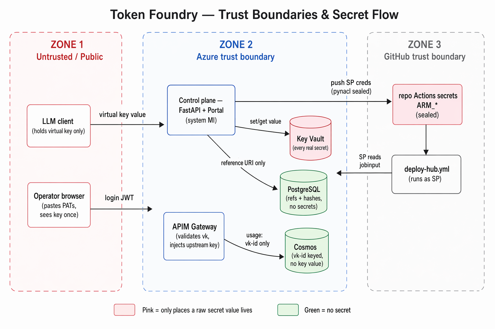
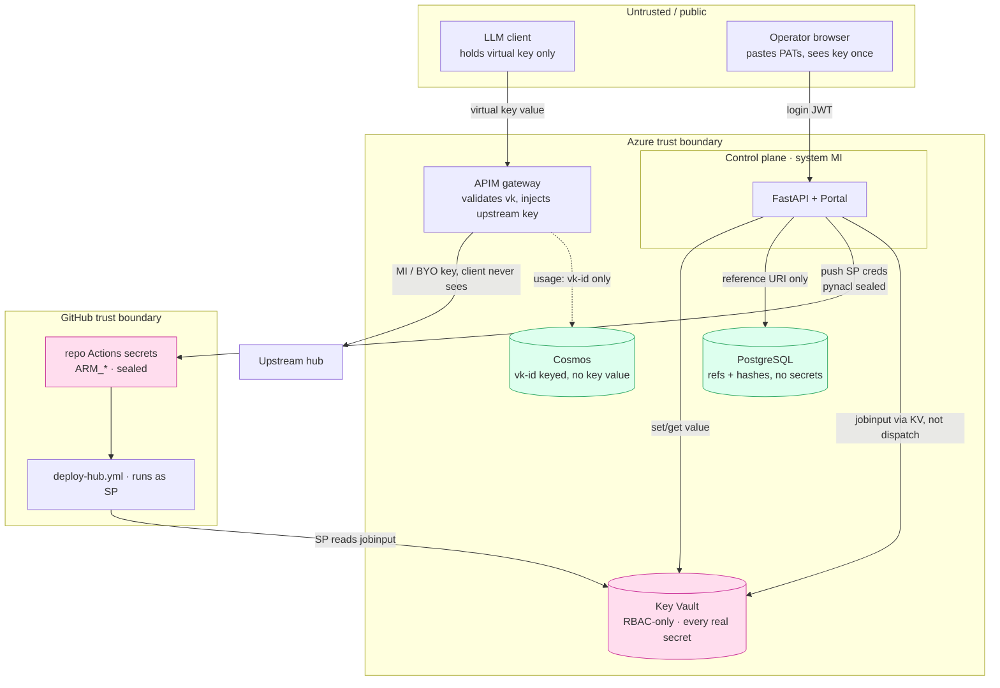

# Security & Data Model

**English** | [中文](SECURITY.zh.md)

How Token Foundry stores secrets and data: what lives where, what's a value vs.
a reference, how callers and users are authenticated, and the known trade-offs.
Every claim here is grounded in the code — file references are given so you can
check.

## TL;DR — where each thing lives

| Data | Store | Form | Why |
|---|---|---|---|
| Virtual key **value** (the `vk_…` secret a client calls with) | **Key Vault** + APIM | Real value in APIM's subscription store; a **Key Vault reference** (URI) recorded in PostgreSQL | The value is shown to the operator **once** at issue time and never again. |
| BYO provider API key (customer's own Anthropic/OpenAI/… key) | **Key Vault** + APIM backend | Real value in Key Vault and in the APIM backend credential; PostgreSQL holds only the route metadata | Isolated per route; injected by the gateway, never returned to clients. |
| DB connection string, JWT signing secret, seed admin password | **Key Vault** | Secret values, written once at deploy; injected into the app as Key Vault references | App never holds them in code or plain config. |
| 方案 A deploy secrets: deployment SP creds, 2 GitHub PATs, per-account hub creds | **Key Vault** | Secret values (`deployer-sp-*`, `github-*`, `gh-<id>-*`) | Drive the cloud-automatic hub onboarding; per-account creds reach the GitHub Action via KV, never as dispatch inputs. |
| User login passwords | **PostgreSQL** | **PBKDF2-HMAC-SHA256 hash** (240k iterations, per-user salt) — never plaintext | Database-backed login; verified in constant time. |
| Tenants / projects / virtual-key metadata / model routes / budgets / users | **PostgreSQL** | Identifiers, settings, references — **no secret values** | Relational control-plane state. |
| Per-call usage records (one per LLM call) | **Cosmos DB** | Raw provider response JSON + metadata; keyed by **virtual-key id**, never the key value | High-write time-series for metering; 90-day TTL. |

**The one rule that ties it together:** the control plane **never persists a raw
secret in PostgreSQL** — only a Key Vault reference
([`app/services/keyvault.py`](../app/services/keyvault.py) lines 1–7). Key Vault
is the single choke point for set/get/delete.

## Trust boundaries & secret flow

**Read it as three boundaries.** A **public** client only ever holds a virtual
key (never an upstream provider key — APIM injects that). The **Azure** boundary
keeps every real secret in Key Vault; PostgreSQL and Cosmos hold only references
/ ids (green = no secret value). The **GitHub** boundary holds the SP creds as
sealed repo secrets, and the Action reads per-account creds from Key Vault (not
from dispatch inputs). The pink nodes are the only places a raw secret value
lives.

## Key Vault — the secret store

Azure Key Vault holds every real secret. It is configured **RBAC-authorization
only** (no access policies), soft-delete 7 days
([`terraform/modules/keyvault/main.tf`](../terraform/modules/keyvault/main.tf)).

What gets written, and by whom:

| Secret name | Contains | Written by | When |
|---|---|---|---|
| `vk-<key-id>` | Virtual key value (the APIM subscription primary key) | Container App **system identity** (Key Vault Secrets Officer) | Each time a key is issued |
| `route-<route-id>-backend` | A BYO provider's API key | Container App system identity | Each time a BYO route is added |
| `tf-database-url` | Full PostgreSQL connection string (includes the DB password) | Terraform, at deploy | Once, at infrastructure deploy |
| `tf-jwt-secret` | HS256 signing secret for login JWTs | Terraform, at deploy | Once |
| `tf-admin-password` | Seed admin account password | Terraform, at deploy | Once |
| `deployer-sp-client-id` / `-client-secret` / `-tenant-id` / `-subscription-id` | 方案 A deployment Service Principal creds | `create-deployer-sp.sh` | At SP creation / rotation |
| `github-bootstrap-pat` | GitHub PAT (repo Admin/Secrets write) — pushes SP creds to the repo | Portal deploy-config | When the operator pastes it |
| `hub-deploy-github-token` | GitHub PAT (Actions RW) — control plane triggers/polls `deploy-hub.yml` | Portal deploy-config | When the operator pastes it |
| `github-repo-configured` | `"true"` flag — repo Actions secrets/vars have been pushed | Portal deploy-config | On a successful push |
| `gh-<id>-oauth` | A GitHub account's Copilot OAuth token | Control plane (device flow) | On account authorization |
| `gh-<id>-hubkey` | That account's hub `/v1` API key (also the APIM backend credential) | Control plane (deploy) | On hub deploy |
| `gh-<id>-admin` | That account's hub admin token | Control plane (deploy) | On hub deploy |
| `gh-<id>-jobinput` | JSON `{oauth, admin, hubkey}` the GitHub Action reads (secrets never travel as dispatch inputs) | Control plane (terraform_runner) | Before each deploy/destroy dispatch |

The first five rows are the base control-plane secrets; the rest are the **方案 A
onboarding** secrets (deployment SP, GitHub PATs, per-account hub creds) — see
[the 方案 A section](#方案-a--cloud-automatic-hub-onboarding-secrets) below.

`set_secret` returns the secret's **reference id (URI)**; that URI — not the
value — is what's stored in PostgreSQL
([`keyvault.py`](../app/services/keyvault.py) lines 51–58). The runtime app
resolves `tf-database-url` / `tf-jwt-secret` / `tf-admin-password` as **Key Vault
secret references** injected by Container Apps as env vars
([`terraform/modules/containerapps/main.tf`](../terraform/modules/containerapps/main.tf)),
so the values never appear in source or plain app config.

Two managed identities are used by design
([`terraform/modules/containerapps/main.tf`](../terraform/modules/containerapps/main.tf)):

- A **user-assigned** identity (`*-acrpull-id`) — pre-granted AcrPull + Key Vault
  **Secrets User** (read) so the first revision can pull its image and resolve
  the secret references at startup, before the app's own identity exists.
- The **system-assigned** identity — the runtime credential. It writes
  subscription keys + BYO secrets, so it needs Key Vault **Secrets Officer**
  (read/write), plus APIM Service Contributor, Cosmos Data Contributor, and
  Monitoring Reader (see RBAC below). In cloud the code explicitly selects the
  system identity (`ManagedIdentityCredential`) so a bare `DefaultAzureCredential`
  can't accidentally pick the read-only pull identity when writing
  ([`keyvault.py`](../app/services/keyvault.py) lines 21–34).

## PostgreSQL — control-plane metadata (no secrets)

PostgreSQL Flexible Server 16, database `tokenfoundry`. Holds the relational
state of the control plane. The full schema is
[`app/models/orm.py`](../app/models/orm.py):

| Table | Holds | Anything sensitive? |
|---|---|---|
| `tenants` | id, name, mode (RESELL/BYO/INTERNAL), billing account, APIM product ids, status | No |
| `projects` | id, tenant_id, name, cost_center | No |
| `virtual_keys` | id, project_id, APIM subscription id, **`keyvault_ref`** (URI), allowed routes, TPM tier, budget, status, expiry | **Reference only** — never the key value |
| `model_routes` | id, tenant_id (NULL = platform-pooled), alias, provider, backend id, `auth_mode` (MI or KV_SECRET), pricing | No (BYO secret lives in Key Vault) |
| `budgets` | id, scope (TENANT/PROJECT/KEY), target id, limit/spent USD, action | No |
| `users` | id, username, **`password_hash`**, role (ADMIN/CUSTOMER), tenant_id, disabled | **Hash only** — never plaintext |

The `virtual_keys` model says it directly: *"the key VALUE never lands here —
only a Key Vault reference"* ([`orm.py`](../app/models/orm.py) lines 85–88).

**User passwords** are hashed with **PBKDF2-HMAC-SHA256**, 240,000 iterations, a
16-byte random salt per user, stored as
`pbkdf2_sha256$<iterations>$<salt_hex>$<hash_hex>`, and verified in constant time
with `hmac.compare_digest` ([`app/services/passwords.py`](../app/services/passwords.py)).
No third-party crypto dependency — Python standard library only.

The seed admin is created once at startup from `TF_ADMIN_PASSWORD` (a Key Vault
reference) and **hashed immediately**; the plaintext is never stored, and the
seed is idempotent (skipped if the admin already exists)
([`app/init_db.py`](../app/init_db.py)).

## Cosmos DB — usage records (no secret values)

Cosmos DB for NoSQL, **serverless**, **`disableLocalAuth: true`** — master keys
are off, access is **AAD-only** ([`infra/modules/cosmos.bicep`](../infra/modules/cosmos.bicep)).
Database `tokenfoundry`, container `usage`, partition key `/pk`
(`<subscriptionId>_<yyyymm>`), **90-day TTL** on raw documents.

One document is written per successful LLM call by the **APIM outbound policy**
([`apim/policies/outbound-cosmos-write.xml`](../apim/policies/outbound-cosmos-write.xml)):

| Field | Content |
|---|---|
| `id` | APIM request id |
| `pk` | partition key, `<subscriptionId>_<yyyymm>` |
| `ts` | timestamp (ISO 8601) |
| `subscription` | **virtual-key id** (the APIM subscription id) — **not the key value** |
| `tenant` / `route` | from `x-tf-*` headers, default `"unknown"` (observability only — see below) |
| `region`, `api` | Azure region, APIM API id |
| `raw_response` | the provider's **full response JSON** (tokens are parsed from here at read time) |

Tokens are **not** parsed at write time — providers differ
(`prompt_tokens`/`completion_tokens` vs. Anthropic/Responses
`input_tokens`/`output_tokens`), so the raw JSON is stored and normalized when
read ([`app/api/usage.py`](../app/api/usage.py), `_extract_tokens`).

**No secret lands in Cosmos.** The record is keyed on the virtual-key **id**
(authenticated by APIM, not spoofable), never the key value. When the portal
shows a tenant's usage, it resolves the tenant's virtual-key ids from PostgreSQL
and queries Cosmos by those ids — so the `x-tf-tenant` header is **observability
only and is not trusted for isolation** ([`usage.py`](../app/api/usage.py),
`query_by_subscriptions`).

## 方案 A — cloud-automatic hub onboarding (secrets)

Adding a GitHub Copilot account deploys a dedicated GitModel hub via a **GitHub
Action** that runs the hub Terraform with a **Service Principal**. The control
plane only triggers + polls that Action and reads outputs from remote state — it
never runs Terraform itself. The secret flow has three tiers:

**1. Deployment SP creds** (`deployer-sp-*`). Created by
[`scripts/create-deployer-sp.sh`](../scripts/create-deployer-sp.sh), which grants
the SP its role bundle (see RBAC below) and writes the four creds to Key Vault.
The Portal's deploy-config flow reads them back to push into the repo.

**2. GitHub PATs.** GitHub can't mint PATs via API (by design), so an operator
generates two and pastes them in the Portal
([`app/api/deploy_config.py`](../app/api/deploy_config.py)):

- `github-bootstrap-pat` — repo Administration + Secrets: write. Used **once** to
  push the SP creds into the repo's Actions secrets (`ARM_*`) + set Actions
  variables (`HUB_*` / `TFSTATE_*`). Secrets are libsodium-sealed with the repo
  public key before upload ([`app/services/github_repo.py`](../app/services/github_repo.py),
  `encrypt_secret`) — no `gh` CLI, pure REST.
- `hub-deploy-github-token` — Actions: read + write. The **runtime** token the
  control plane uses to `workflow_dispatch` + poll `deploy-hub.yml`
  ([`terraform_runner.py`](../app/services/terraform_runner.py) reads it by this
  exact name).

**3. Per-account hub creds** (`gh-<id>-*`). On each account deploy the control
plane mints an admin token + a hub `/v1` key, and holds the account's Copilot
OAuth token. These travel to the Action via **Key Vault**, never as dispatch
inputs or run logs: the control plane writes `gh-<id>-jobinput` (JSON of all
three) and the Action reads it with the SP's Key Vault Secrets User role
([`terraform_runner.py`](../app/services/terraform_runner.py), `_write_jobinput`).

### ⚠️ The isolation trade-off (deliberate)

方案 A's original design kept the SP creds **only** in GitHub repo secrets, so a
compromised control plane could not reach the subscription-wide SP. The current
Portal flow **also stores the SP creds in Key Vault** (`deployer-sp-*`) so the
push can be re-run from the UI after an SP rotation. Because the control plane's
managed identity is **Key Vault Secrets Officer**, it can now read those creds —
a compromised control plane could read a Contributor + User Access Administrator
SP. This is a conscious choice to get a fully-automated deploy → configure chain;
to restore the stricter isolation, stop writing `deployer-sp-*` to Key Vault and
pass the creds via env/eval instead (noted in `create-deployer-sp.sh`).

## Authentication

### Calling the gateway (data plane)

A client calls a provider API with its **virtual key** in that provider's native
header (`x-api-key` for Anthropic, `api-key`/`Authorization` for OpenAI-style).
The virtual key **is an APIM subscription key**; APIM validates it and applies
the per-key token-limit, keyed on the subscription id
(the inbound policy XML in [`app/services/apim_provisioner.py`](../app/services/apim_provisioner.py)).

The **real upstream provider key** is never seen by the client:

- **Platform-pooled** (RESELL/INTERNAL) routes call Azure OpenAI with APIM's
  **managed identity** (`auth_mode = MI`) — no key in the request at all.
- **BYO** routes inject the customer's key from the **APIM backend credential**
  (`auth_mode = KV_SECRET`); the secret is also stored in Key Vault.

### Logging in to the portal (control plane)

Self-hosted, database-backed login. On success the backend signs a short-lived
**HS256 JWT** (`settings.jwt_secret`, from Key Vault; default expiry 8 hours)
carrying `sub`, `role`, `tenant_id`
([`app/services/tokens.py`](../app/services/tokens.py)). Every request is
verified against the same secret ([`app/api/auth.py`](../app/api/auth.py)).

**The tenant-isolation red line:** the backend **never trusts a tenant id from
the request** — it derives the caller's tenant from the token and forces every
customer query to filter by it. `require_admin` gates platform-only operations;
`tenant_scope` returns the caller's enforced tenant for customer endpoints and
rejects a principal with no tenant ([`auth.py`](../app/api/auth.py) lines 97–108).
A customer endpoint like `GET /usage` takes its tenant from
`Depends(tenant_scope)`, not from any parameter.

A local dev-token shortcut (`dev:<role>:<tenant>`) exists **only** when
`TF_ENVIRONMENT=local`, so the stack runs end-to-end without an identity
provider. It is off in dev/prod ([`auth.py`](../app/api/auth.py) lines 35–47, 84–86).

## Identities & RBAC (who can touch what)

| Identity | Role | On | Why |
|---|---|---|---|
| Container App — system | API Management Service Contributor | APIM | Provision products / subscriptions / backends at runtime |
| Container App — system | Key Vault Secrets Officer | Key Vault | Write virtual-key + BYO secrets, read them back |
| Container App — system | Cosmos DB Data Contributor | Cosmos | Read usage records |
| Container App — system | Monitoring Reader | App Insights | Query latency/telemetry via KQL |
| Container App — system | Storage Blob Data Reader | tfstate storage | Read `hubs/<id>.tfstate` outputs (方案 A, no Terraform) |
| Container App — user-assigned | AcrPull + Key Vault Secrets User | ACR + Key Vault | Pull the image, resolve secret refs at startup (pre-granted) |
| APIM — system | Cosmos DB Data Contributor | Cosmos | Outbound policy writes one usage doc per call |
| Deployment SP | Contributor | Subscription | Terraform creates a new RG + resources per hub account |
| Deployment SP | User Access Administrator | Subscription | Terraform assigns roles to each hub's managed identity |
| Deployment SP | Key Vault Secrets User | Key Vault | The Action reads `gh-<id>-jobinput` at run time |
| Deployment SP | Storage Blob Data Contributor | tfstate storage | Terraform reads+writes the per-account remote state |

The deployment SP's four roles are granted by
[`scripts/create-deployer-sp.sh`](../scripts/create-deployer-sp.sh). **User Access
Administrator is high-privilege** (it can grant roles) — required because the hub
Terraform wires each hub's identity to ACR/KV; pass `--no-uaa` to skip it if your
posture forbids it (then pre-create hub identities out-of-band).

Cosmos is **AAD-only** (`disableLocalAuth: true`) and Key Vault is
**RBAC-authorization** — both reject shared-key access by configuration.

## Known trade-offs & gaps (honest list)

These are deliberate MVP choices or noted TODOs — not surprises:

1. **Fire-and-forget usage writes.** The Cosmos write is
   `send-one-way-request` with **no retry** — if Cosmos is briefly unavailable,
   that call's usage record is lost. Chosen so usage capture never adds latency
   to the LLM path; billing-grade accounting is the Phase-2 Event Hub path
   ([`outbound-cosmos-write.xml`](../apim/policies/outbound-cosmos-write.xml) lines 8–9).
2. **PostgreSQL firewall = AllowAzureServices (0.0.0.0).** The DB is reachable
   from Azure services, not just this app. The module comment flags it:
   *"Tighten to VNet integration in prod"*
   ([`terraform/modules/postgres/main.tf`](../terraform/modules/postgres/main.tf)).
3. **`raw_response` is stored unfiltered.** Today's providers (OpenAI/Anthropic/
   Google) return completion + usage, not an echo of the prompt, so prompts are
   not persisted — but completions can contain whatever the model produced, and
   nothing sanitizes the field. Treat the Cosmos `usage` container as
   potentially containing user-generated content and protect it accordingly.
4. **BYO key rotation is not automatic.** A BYO secret is set on the APIM backend
   credential at creation; updating the Key Vault copy does **not** roll the
   gateway until the backend is re-provisioned.
5. **Semantic cache (Phase 2) must be tenant-partitioned.** Not yet enabled; when
   it is, it must `vary-by` the subscription id or it would leak responses across
   tenants — called out in the policy comments
   (the inbound policy XML in [`app/services/apim_provisioner.py`](../app/services/apim_provisioner.py)).
6. **Virtual keys can't be recovered, only rotated.** The value is shown once and
   only a Key Vault reference is kept; a lost key is re-issued, not retrieved.
   (This is correct key hygiene, listed so the behavior isn't a surprise.)
7. **No JWT refresh.** Login tokens last 8 hours and there is no refresh
   endpoint; clients re-authenticate after expiry.
8. **Deployment SP creds live in Key Vault (方案 A).** For a fully-automated
   Portal flow, `deployer-sp-*` are stored in Key Vault, which the control-plane
   identity (Secrets Officer) can read — a compromised control plane could read a
   subscription-wide Contributor + UAA SP. Deliberate trade-off; see the 方案 A
   isolation note above. Restore isolation by not persisting these to Key Vault.
9. **PATs are high-privilege and long-lived.** The bootstrap PAT can write repo
   secrets; the deploy PAT can read/write Actions. Both sit in Key Vault until
   rotated. Scope them to the single target repo and rotate on a schedule.
