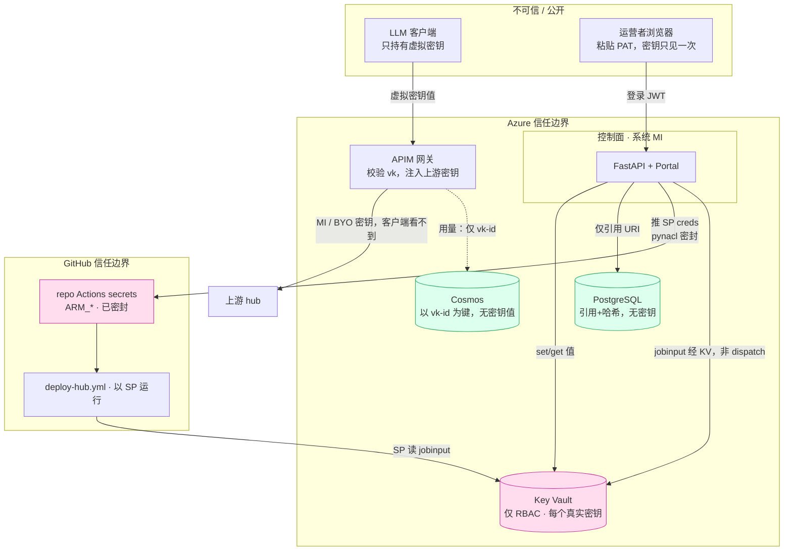

# 安全与数据模型

[English](SECURITY.md) | **中文**

Token Foundry 怎么存储密钥和数据:什么存在哪、存的是值还是引用、调用方和用户
怎么鉴权,以及已知的取舍。这里每一条都有代码依据 —— 给出了文件位置,你可以自己核对。

## 一句话总览 —— 各类数据存在哪

| 数据 | 存储 | 形态 | 为什么 |
|---|---|---|---|
| 虚拟密钥**值**(客户端用来调用的 `vk_…` 密钥) | **Key Vault** + APIM | 真实值在 APIM 的订阅存储里;PostgreSQL 里只记一个 **Key Vault 引用**(URI) | 签发时只给运营看**一次**,之后再不显示。 |
| BYO 供应商 API 密钥(客户自带的 Anthropic/OpenAI/… 密钥) | **Key Vault** + APIM 后端 | 真实值存在 Key Vault 和 APIM 后端凭据里;PostgreSQL 只存路由元数据 | 按路由隔离;由网关注入,绝不回传给客户端。 |
| 数据库连接串、JWT 签名密钥、种子管理员密码 | **Key Vault** | 密钥值,部署时写入一次;以 Key Vault 引用形式注入应用 | 应用从不在代码或明文配置里持有它们。 |
| 方案 A 部署密钥:部署 SP creds、2 个 GitHub PAT、每账号 hub creds | **Key Vault** | 密钥值(`deployer-sp-*`、`github-*`、`gh-<id>-*`) | 驱动云端自动 hub 接入;每账号 creds 经 KV 送达 GitHub Action,绝不作为 dispatch 输入。 |
| 用户登录密码 | **PostgreSQL** | **PBKDF2-HMAC-SHA256 哈希**(24 万次迭代,每用户独立盐)—— 绝非明文 | 数据库登录;常数时间校验。 |
| 租户 / 项目 / 虚拟密钥元数据 / 模型路由 / 预算 / 用户 | **PostgreSQL** | 标识符、设置、引用 —— **不存任何密钥值** | 关系型控制平面状态。 |
| 每次调用的用量记录(每次 LLM 调用一条) | **Cosmos DB** | 供应商原始响应 JSON + 元数据;以**虚拟密钥 id** 为键,从不存密钥值 | 用于计量的高写入时序;90 天 TTL。 |

**串起这一切的那条铁律:** 控制平面**绝不在 PostgreSQL 里持久化原始密钥** ——
只存 Key Vault 引用([`app/services/keyvault.py`](../app/services/keyvault.py) 第 1–7 行)。
Key Vault 是 set/get/delete 的唯一收口点。

## 信任边界与密钥流

**按三条边界看。** **公开**的客户端只持有虚拟密钥(永远拿不到上游供应商密钥 —— 那由 APIM
注入)。**Azure** 边界把每个真实密钥都锁在 Key Vault;PostgreSQL 和 Cosmos 只存引用 / id
(绿色 = 无密钥值)。**GitHub** 边界把 SP creds 存成密封的 repo secrets,Action 从 Key Vault
读每账号 creds(不从 dispatch 输入)。粉色节点是唯一存放原始密钥值的地方。

## Key Vault —— 密钥存储

Azure Key Vault 持有每一个真实密钥。配置为**仅 RBAC 授权**(不用访问策略),
软删除 7 天([`terraform/modules/keyvault/main.tf`](../terraform/modules/keyvault/main.tf))。

写入了什么、谁写的:

| 密钥名 | 内容 | 写入者 | 何时 |
|---|---|---|---|
| `vk-<key-id>` | 虚拟密钥值(APIM 订阅主密钥) | Container App **系统身份**(Key Vault Secrets Officer) | 每次签发密钥 |
| `route-<route-id>-backend` | 某 BYO 供应商的 API 密钥 | Container App 系统身份 | 每次添加 BYO 路由 |
| `tf-database-url` | 完整 PostgreSQL 连接串(含数据库密码) | Terraform,部署时 | 一次,基础设施部署时 |
| `tf-jwt-secret` | 登录 JWT 的 HS256 签名密钥 | Terraform,部署时 | 一次 |
| `tf-admin-password` | 种子管理员账号密码 | Terraform,部署时 | 一次 |
| `deployer-sp-client-id` / `-client-secret` / `-tenant-id` / `-subscription-id` | 方案 A 部署服务主体 creds | `create-deployer-sp.sh` | SP 创建/轮换时 |
| `github-bootstrap-pat` | GitHub PAT(repo Admin/Secrets 写)—— 把 SP creds 推到仓库 | Portal 部署配置 | 运营者粘贴时 |
| `hub-deploy-github-token` | GitHub PAT(Actions 读写)—— 控制面触发/轮询 `deploy-hub.yml` | Portal 部署配置 | 运营者粘贴时 |
| `github-repo-configured` | `"true"` 标志 —— repo Actions secrets/vars 已推送 | Portal 部署配置 | 推送成功时 |
| `gh-<id>-oauth` | 某 GitHub 账号的 Copilot OAuth token | 控制面(设备流) | 账号授权时 |
| `gh-<id>-hubkey` | 该账号的 hub `/v1` API key(同时是 APIM 后端凭据) | 控制面(部署) | hub 部署时 |
| `gh-<id>-admin` | 该账号的 hub admin token | 控制面(部署) | hub 部署时 |
| `gh-<id>-jobinput` | GitHub Action 读取的 JSON `{oauth, admin, hubkey}`(密钥绝不作为 dispatch 输入) | 控制面(terraform_runner) | 每次部署/销毁 dispatch 前 |

前五行是基础控制平面密钥;其余是**方案 A 接入**密钥(部署 SP、GitHub PAT、每账号 hub
creds)—— 见下方"方案 A —— 云端自动 hub 接入(密钥)"章节。

`set_secret` 返回密钥的**引用 id(URI)**;存进 PostgreSQL 的是这个 URI 而不是值
([`keyvault.py`](../app/services/keyvault.py) 第 51–58 行)。运行时应用把
`tf-database-url` / `tf-jwt-secret` / `tf-admin-password` 作为 **Key Vault 密钥引用**
由 Container Apps 注入为环境变量
([`terraform/modules/containerapps/main.tf`](../terraform/modules/containerapps/main.tf)),
因此这些值从不出现在源码或明文应用配置里。

有意使用**两个**托管身份
([`terraform/modules/containerapps/main.tf`](../terraform/modules/containerapps/main.tf)):

- 一个**用户分配**身份(`*-acrpull-id`)—— 预先授予 AcrPull + Key Vault
  **Secrets User**(读),这样第一个修订版能在应用自身身份存在之前就拉取镜像、
  在启动时解析密钥引用。
- **系统分配**身份 —— 运行时凭据。它要写订阅密钥 + BYO 密钥,所以需要 Key Vault
  **Secrets Officer**(读写),外加 APIM Service Contributor、Cosmos Data
  Contributor、Monitoring Reader(见下方 RBAC)。云上代码显式选择系统身份
  (`ManagedIdentityCredential`),以免裸用 `DefaultAzureCredential` 在写密钥时
  误选只读的拉取身份([`keyvault.py`](../app/services/keyvault.py) 第 21–34 行)。

## PostgreSQL —— 控制平面元数据(不存密钥)

PostgreSQL Flexible Server 16,数据库 `tokenfoundry`。持有控制平面的关系型状态。
完整 schema 见 [`app/models/orm.py`](../app/models/orm.py):

| 表 | 存什么 | 有敏感信息吗? |
|---|---|---|
| `tenants` | id、名称、模式(RESELL/BYO/INTERNAL)、计费账户、APIM product id、状态 | 无 |
| `projects` | id、tenant_id、名称、成本中心 | 无 |
| `virtual_keys` | id、project_id、APIM 订阅 id、**`keyvault_ref`**(URI)、允许的路由、TPM 档、预算、状态、过期 | **只有引用** —— 绝无密钥值 |
| `model_routes` | id、tenant_id(NULL = 平台池化)、别名、供应商、后端 id、`auth_mode`(MI 或 KV_SECRET)、定价 | 无(BYO 密钥在 Key Vault) |
| `budgets` | id、范围(TENANT/PROJECT/KEY)、目标 id、上限/已用 USD、动作 | 无 |
| `users` | id、用户名、**`password_hash`**、角色(ADMIN/CUSTOMER)、tenant_id、是否停用 | **只有哈希** —— 绝无明文 |

`virtual_keys` 模型里写得很直白:*"密钥 VALUE 绝不落在这里 —— 只有 Key Vault 引用"*
([`orm.py`](../app/models/orm.py) 第 85–88 行)。

**用户密码**用 **PBKDF2-HMAC-SHA256** 哈希,24 万次迭代,每用户 16 字节随机盐,
以 `pbkdf2_sha256$<迭代次数>$<盐_hex>$<哈希_hex>` 格式存储,并用
`hmac.compare_digest` 做常数时间校验
([`app/services/passwords.py`](../app/services/passwords.py))。无第三方加密依赖 ——
仅用 Python 标准库。

种子管理员在启动时从 `TF_ADMIN_PASSWORD`(一个 Key Vault 引用)创建一次,并**立即
哈希**;明文从不存储,且该播种是幂等的(管理员已存在则跳过)
([`app/init_db.py`](../app/init_db.py))。

## Cosmos DB —— 用量记录(不存密钥值)

Cosmos DB for NoSQL,**Serverless**,**`disableLocalAuth: true`** —— master key
关闭,访问**仅限 AAD**([`infra/modules/cosmos.bicep`](../infra/modules/cosmos.bicep))。
数据库 `tokenfoundry`,容器 `usage`,分区键 `/pk`(`<订阅id>_<yyyymm>`),原始文档
**90 天 TTL**。

每次成功的 LLM 调用,由 **APIM 出站策略**写一条文档
([`apim/policies/outbound-cosmos-write.xml`](../apim/policies/outbound-cosmos-write.xml)):

| 字段 | 内容 |
|---|---|
| `id` | APIM 请求 id |
| `pk` | 分区键,`<订阅id>_<yyyymm>` |
| `ts` | 时间戳(ISO 8601) |
| `subscription` | **虚拟密钥 id**(APIM 订阅 id)—— **不是密钥值** |
| `tenant` / `route` | 来自 `x-tf-*` 请求头,默认 `"unknown"`(仅用于观测 —— 见下) |
| `region`、`api` | Azure 区域、APIM API id |
| `raw_response` | 供应商的**完整响应 JSON**(token 在读取时从这里解析) |

写入时**不**解析 token —— 各家格式不同(`prompt_tokens`/`completion_tokens` vs.
Anthropic/Responses 的 `input_tokens`/`output_tokens`),所以原样存 JSON,读取时再
归一化([`app/api/usage.py`](../app/api/usage.py) 的 `_extract_tokens`)。

**Cosmos 里不落任何密钥。** 记录以虚拟密钥 **id** 为键(由 APIM 鉴权,无法伪造),
从不存密钥值。门户展示某租户用量时,先从 PostgreSQL 查出该租户的虚拟密钥 id,
再用这些 id 去查 Cosmos —— 所以 `x-tf-tenant` 请求头**仅用于观测,不用于隔离**
([`usage.py`](../app/api/usage.py) 的 `query_by_subscriptions`)。

## 方案 A —— 云端自动 hub 接入(密钥)

添加一个 GitHub Copilot 账号会经由一个 **GitHub Action** 部署一套专属 GitModel hub,
该 Action 用**服务主体**跑 hub Terraform。控制面只触发+轮询该 Action、从远程 state 读
输出 —— 自己从不跑 Terraform。密钥流分三层:

**1. 部署 SP creds**(`deployer-sp-*`)。由
[`scripts/create-deployer-sp.sh`](../scripts/create-deployer-sp.sh) 创建,该脚本授予 SP
其角色包(见下方 RBAC)并把四个 creds 写入 Key Vault。Portal 部署配置流程再读回它们推到仓库。

**2. GitHub PAT。** GitHub 不支持 API 生成 PAT(安全设计),所以运营者生成两个并在 Portal
粘贴([`app/api/deploy_config.py`](../app/api/deploy_config.py)):

- `github-bootstrap-pat` —— repo Administration + Secrets:写。**一次性**用于把 SP creds
  推成仓库的 Actions secrets(`ARM_*`)+ 设 Actions variables(`HUB_*` / `TFSTATE_*`)。
  secret 上传前用仓库公钥做 libsodium 密封
  ([`app/services/github_repo.py`](../app/services/github_repo.py) 的 `encrypt_secret`)——
  不用 `gh` CLI,纯 REST。
- `hub-deploy-github-token` —— Actions:读+写。控制面**运行时**用它 `workflow_dispatch` +
  轮询 `deploy-hub.yml` 的 token([`terraform_runner.py`](../app/services/terraform_runner.py)
  按这个确切名字读取)。

**3. 每账号 hub creds**(`gh-<id>-*`)。每次账号部署,控制面生成一个 admin token + 一个 hub
`/v1` key,并持有该账号的 Copilot OAuth token。这些经 **Key Vault** 送达 Action,绝不作为
dispatch 输入或 run 日志:控制面写 `gh-<id>-jobinput`(三者的 JSON),Action 用 SP 的
Key Vault Secrets User 角色读取
([`terraform_runner.py`](../app/services/terraform_runner.py) 的 `_write_jobinput`)。

### ⚠️ 隔离取舍(有意为之)

方案 A 原本的设计把 SP creds **只**放在 GitHub repo secrets 里,这样即使控制面被攻破也
够不到订阅级的 SP。当前 Portal 流程**同时把 SP creds 存进 Key Vault**(`deployer-sp-*`),
以便 SP 轮换后能从 UI 重推。由于控制面托管身份是 **Key Vault Secrets Officer**,它现在能读到
这些 creds —— 控制面被攻破就能读到一个 Contributor + User Access Administrator 的 SP。这是为了
换取全自动的 部署 → 配置 链条而做的自觉取舍;要恢复更严的隔离,就别把 `deployer-sp-*` 写入
Key Vault、改用 env/eval 传递(`create-deployer-sp.sh` 里已注明)。

## 鉴权

### 调用网关(数据平面)

客户端把**虚拟密钥**放在供应商原生请求头里调用(Anthropic 用 `x-api-key`,
OpenAI 系用 `api-key`/`Authorization`)。虚拟密钥**就是 APIM 订阅密钥**;APIM 校验它
并施加按密钥的 token 限流,以订阅 id 为键
(内联在 [`app/services/apim_provisioner.py`](../app/services/apim_provisioner.py) 的入站策略 XML)。

**真实的上游供应商密钥**客户端永远看不到:

- **平台池化**(RESELL/INTERNAL)路由用 APIM 的**托管身份**调用 Azure OpenAI
  (`auth_mode = MI`)—— 请求里根本没有密钥。
- **BYO** 路由从 **APIM 后端凭据**注入客户自己的密钥(`auth_mode = KV_SECRET`);
  该密钥同时存在 Key Vault。

### 登录门户(控制平面)

自托管、数据库登录。成功后后端签发一个短时效 **HS256 JWT**(`settings.jwt_secret`,
来自 Key Vault;默认 8 小时过期),携带 `sub`、`role`、`tenant_id`
([`app/services/tokens.py`](../app/services/tokens.py))。每个请求都用同一密钥校验
([`app/api/auth.py`](../app/api/auth.py))。

**租户隔离的红线:** 后端**绝不信任请求里的租户 id** —— 它从 token 里取出调用方的
租户,并强制每个客户查询按它过滤。`require_admin` 把守平台级操作;`tenant_scope`
为客户端点返回强制的租户,并拒绝没有租户的主体([`auth.py`](../app/api/auth.py)
第 97–108 行)。像 `GET /usage` 这样的客户端点,其租户取自 `Depends(tenant_scope)`,
而非任何参数。

本地 dev-token 捷径(`dev:<role>:<tenant>`)**仅在** `TF_ENVIRONMENT=local` 时存在,
让整套栈无需身份提供方即可端到端跑通。dev/prod 下它是关闭的
([`auth.py`](../app/api/auth.py) 第 35–47、84–86 行)。

## 身份与 RBAC(谁能动什么)

| 身份 | 角色 | 作用在 | 为什么 |
|---|---|---|---|
| Container App —— 系统 | API Management Service Contributor | APIM | 运行时开通 product / 订阅 / 后端 |
| Container App —— 系统 | Key Vault Secrets Officer | Key Vault | 写虚拟密钥 + BYO 密钥,并读回 |
| Container App —— 系统 | Cosmos DB Data Contributor | Cosmos | 读用量记录 |
| Container App —— 系统 | Monitoring Reader | App Insights | 用 KQL 查延迟/遥测 |
| Container App —— 系统 | Storage Blob Data Reader | tfstate 存储 | 读 `hubs/<id>.tfstate` 输出(方案 A,不跑 Terraform) |
| Container App —— 用户分配 | AcrPull + Key Vault Secrets User | ACR + Key Vault | 拉镜像、启动时解析密钥引用(预先授予) |
| APIM —— 系统 | Cosmos DB Data Contributor | Cosmos | 出站策略每次调用写一条用量文档 |
| 部署 SP | Contributor | 订阅 | Terraform 为每个 hub 账号建新 RG + 资源 |
| 部署 SP | User Access Administrator | 订阅 | Terraform 给每个 hub 的托管身份分配角色 |
| 部署 SP | Key Vault Secrets User | Key Vault | Action 运行时读 `gh-<id>-jobinput` |
| 部署 SP | Storage Blob Data Contributor | tfstate 存储 | Terraform 读写每账号远程 state |

部署 SP 的四个角色由
[`scripts/create-deployer-sp.sh`](../scripts/create-deployer-sp.sh) 授予。**User Access
Administrator 是高权限**(能授权)—— 之所以需要,是因为 hub Terraform 要给每个 hub 的身份
接线 ACR/KV;若你的安全策略禁止它,可传 `--no-uaa` 跳过(然后带外预建 hub 身份)。

Cosmos **仅限 AAD**(`disableLocalAuth: true`),Key Vault **仅 RBAC 授权** ——
两者都在配置层面拒绝共享密钥访问。

## 已知取舍与短板(诚实清单)

这些都是有意的 MVP 选择或标注过的 TODO —— 不是意外:

1. **即发即忘的用量写入。** Cosmos 写入用 `send-one-way-request` 且**不重试** ——
   若 Cosmos 短暂不可用,那次调用的用量记录就丢了。这么选是为了让用量采集绝不给
   LLM 链路增加延迟;计费级记账走第二阶段的 Event Hub
   ([`outbound-cosmos-write.xml`](../apim/policies/outbound-cosmos-write.xml) 第 8–9 行)。
2. **PostgreSQL 防火墙 = AllowAzureServices(0.0.0.0)。** 数据库对 Azure 服务可达,
   不只是本应用。模块注释已标注:*"生产环境收紧为 VNet 集成"*
   ([`terraform/modules/postgres/main.tf`](../terraform/modules/postgres/main.tf))。
3. **`raw_response` 原样存储、未做过滤。** 当前各家供应商(OpenAI/Anthropic/Google)
   只返回补全 + 用量,不回显 prompt,所以 prompt 不会被持久化 —— 但补全里可能含有
   模型生成的任意内容,而该字段没有任何脱敏。应把 Cosmos `usage` 容器视为可能含有
   用户生成内容,并据此保护。
4. **BYO 密钥轮换不是自动的。** BYO 密钥在创建时写入 APIM 后端凭据;更新 Key Vault
   里的副本**不会**让网关跟着轮换,除非重新开通该后端。
5. **语义缓存(第二阶段)必须按租户分区。** 尚未启用;启用时必须按订阅 id `vary-by`,
   否则会跨租户泄漏响应 —— 这一点在策略注释里已点明
   ([内联在 `app/services/apim_provisioner.py`](../app/services/apim_provisioner.py) 的入站策略 XML)。
6. **虚拟密钥无法找回,只能轮换。** 值只显示一次、只留 Key Vault 引用;丢了就重发一把
   新的,而非取回。(这是正确的密钥卫生,列出来是让这个行为不至于让人意外。)
7. **没有 JWT 刷新。** 登录 token 存活 8 小时,没有刷新端点;过期后客户端需重新登录。
8. **部署 SP creds 存在 Key Vault(方案 A)。** 为了全自动的 Portal 流程,`deployer-sp-*`
   存进 Key Vault,而控制面身份(Secrets Officer)能读到它 —— 控制面被攻破就能读到一个
   订阅级 Contributor + UAA 的 SP。有意的取舍;见上方方案 A 隔离说明。要恢复隔离,就别把
   这些持久化到 Key Vault。
9. **PAT 高权限且长期有效。** bootstrap PAT 能写 repo secrets;deploy PAT 能读写 Actions。
   两者在 Key Vault 里直到轮换。请把它们的作用域限定到唯一目标仓库,并定期轮换。
