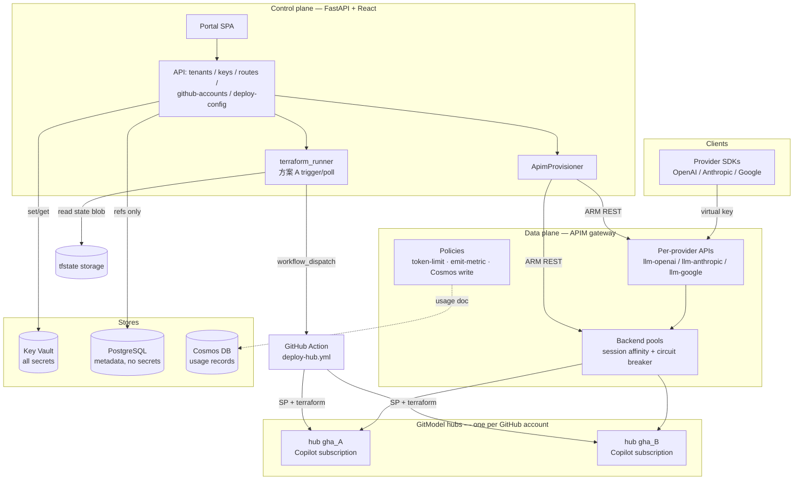
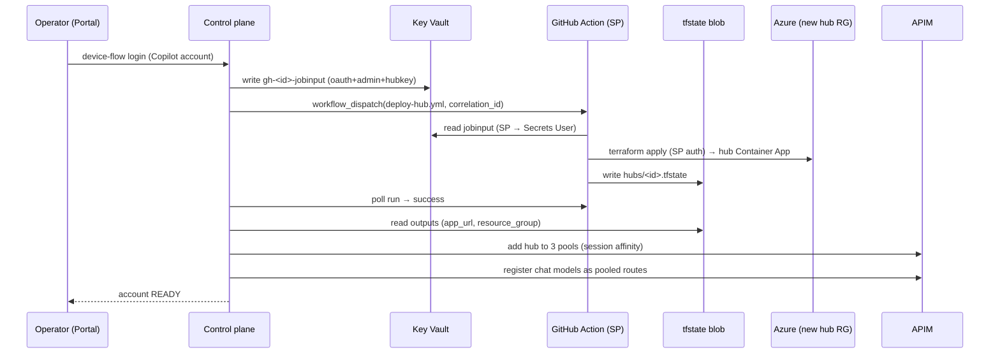
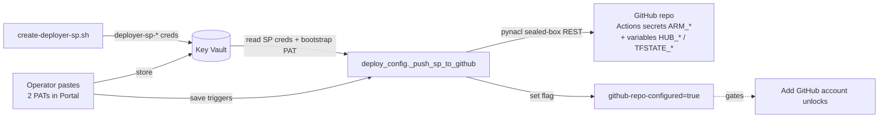
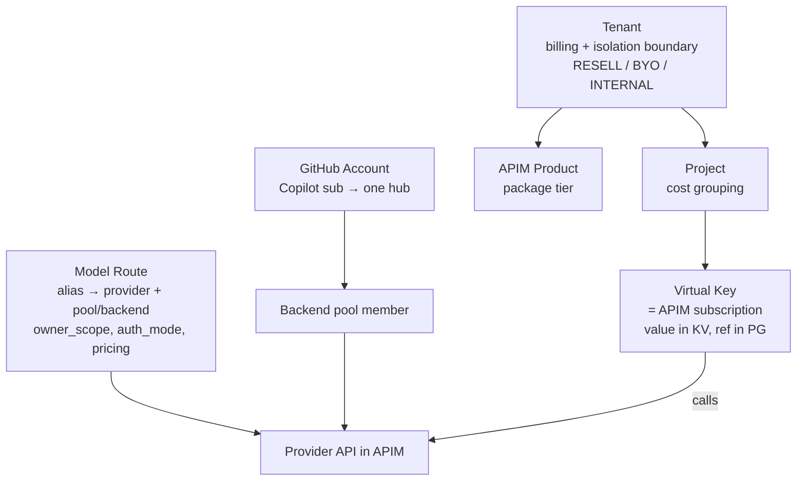

# Architecture

**English** | [中文](architecture.zh.md)

Token Foundry is an Azure-native LLM token hub: a **control plane** (this repo's
FastAPI app + React portal) that turns operator intent into **APIM** gateway
configuration, plus a cloud-automatic path (**方案 A**) that onboards GitHub
Copilot accounts as load-balanced backend hubs. The gateway (APIM) is the data
plane; the control plane never proxies LLM traffic.

> The PNG above is the at-a-glance view. The Mermaid below is the maintainable
> source of truth — update it, then regenerate the PNG if needed.

## System layers

**The one invariant:** the control plane configures the gateway (management
plane) and **never sits in the request path**. LLM traffic goes client → APIM →
hub, metered by APIM policy. The control plane's job is to make APIM objects
(APIs, backends, pools, subscriptions) match PostgreSQL intent.

## 方案 A — cloud-automatic hub onboarding

"Adding a model" becomes "adding a GitHub account". The hub Terraform runs inside
a **GitHub Action** authenticated by a Service Principal — the control plane only
triggers + polls it and reads outputs from remote state. This is the best
isolation of the options tried: the SP creds live in GitHub repo secrets; the
control plane holds only a deploy PAT (can trigger a predefined workflow) + blob
read on the state.

### Prerequisite: deploy configuration (one-time)

Before 方案 A can run, the GitHub wiring must be in place — done in the Portal
(not a shell script):

The bootstrap PAT (repo Administration/Secrets write) is used once to push the
SP creds; the deploy PAT (Actions RW) is what the control plane uses at runtime
to trigger + poll. Both stored in Key Vault so a later SP rotation can re-push.

## Business logic — the entity model

- **Tenant** — the billing + isolation boundary. `RESELL` pools platform models
  and resells with markup; `BYO` isolates a customer's own key in Key Vault;
  `INTERNAL` is chargeback-only. Bound to an APIM product so keys can issue.
- **Project** — groups virtual keys under a tenant for cost tracking.
- **Virtual Key** — an APIM subscription key. The value is shown **once** and
  stored in Key Vault; PostgreSQL keeps only a reference.
- **Model Route** — a client-facing alias (`gpt-4o`) → `provider` + APIM
  pool/backend (`apim_backend_or_pool_id`) + `auth_mode` (MI / KV_SECRET) +
  pricing. Platform-pooled routes (`owner_scope=PLATFORM`, `tenant_id=NULL`) fan
  out across every GitHub-account hub; BYO routes bind one tenant's backend.
- **GitHub Account** — one Copilot subscription → one deployed hub → one member
  in each provider pool. Adding accounts adds pool members (idempotent), not
  duplicate routes.

## Where each secret lives

See [SECURITY.md](SECURITY.md) for the full table. In one line: **every real
secret is in Key Vault; PostgreSQL holds only references; Cosmos holds only the
virtual-key id, never its value.**
