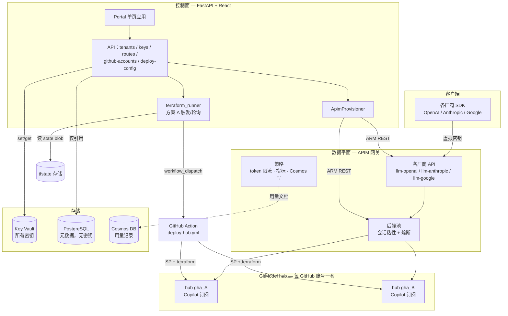
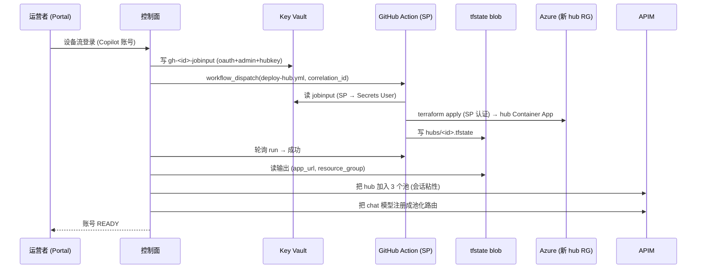
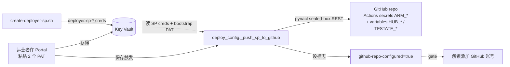
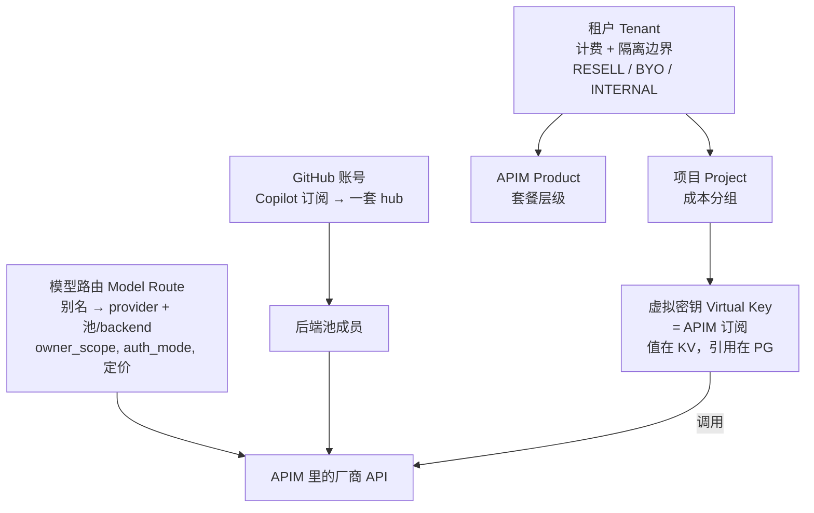

# 架构

[English](architecture.md) | **中文**

Token Foundry 是 Azure 原生的 LLM token hub：一个**控制面**（本仓库的 FastAPI app +
React portal）把运营者的意图转成 **APIM** 网关配置，外加一条云端自动的路径（**方案 A**）
把 GitHub Copilot 账号接入成负载均衡的后端 hub。网关（APIM）是数据平面；控制面从不代理
LLM 流量。

> 上方 PNG 是一眼概览。下面的 Mermaid 是可维护的事实来源——改它，需要时再重新生成 PNG。

## 系统分层

**唯一不变量：** 控制面配置网关（管理平面），**从不在请求路径上**。LLM 流量走 客户端 →
APIM → hub，由 APIM 策略计量。控制面的职责是让 APIM 对象（API、backend、池、订阅）与
PostgreSQL 意图对齐。

## 方案 A — 云端自动 hub 接入

"添加模型"变成"添加 GitHub 账号"。hub Terraform 在**GitHub Action** 里跑、由服务主体
认证——控制面只触发+轮询它、从远程 state 读输出。这是尝试过的方案里隔离最好的：SP creds
在 GitHub repo secrets 里；控制面只有一个 deploy PAT（能触发预定义 workflow）+ state 的
blob 读权。

### 前置：部署配置（一次性）

方案 A 能跑之前，GitHub 接线必须就位——在 Portal 里做（不是 shell 脚本）：

bootstrap PAT（repo Administration/Secrets 写）一次性用于推 SP creds；deploy PAT
（Actions 读写）是控制面运行时触发+轮询用的。两者都存 Key Vault，以便日后 SP 轮换时重推。

## 业务逻辑 — 实体模型

- **租户** — 计费 + 隔离边界。`RESELL` 池化平台模型加价转售；`BYO` 把客户自带 key 隔离在
  Key Vault；`INTERNAL` 仅内部计费。绑定一个 APIM product 才能签发 key。
- **项目** — 在租户下把虚拟密钥分组做成本追踪。
- **虚拟密钥** — 一个 APIM 订阅 key。值只显示**一次**并存入 Key Vault；PostgreSQL 只留引用。
- **模型路由** — 客户端别名（`gpt-4o`）→ `provider` + APIM 池/backend
  （`apim_backend_or_pool_id`）+ `auth_mode`（MI / KV_SECRET）+ 定价。平台池化路由
  （`owner_scope=PLATFORM`、`tenant_id=NULL`）在每个 GitHub 账号 hub 间扇出；BYO 路由绑一个
  租户的 backend。
- **GitHub 账号** — 一个 Copilot 订阅 → 一套部署的 hub → 每个厂商池里的一个成员。加账号是
  给池加成员（幂等），不是加重复路由。

## 每个密钥存哪

完整表见 [SECURITY.zh.md](SECURITY.zh.md)。一句话：**每个真实密钥都在 Key Vault；
PostgreSQL 只存引用；Cosmos 只存虚拟密钥 id，绝不存其值。**
